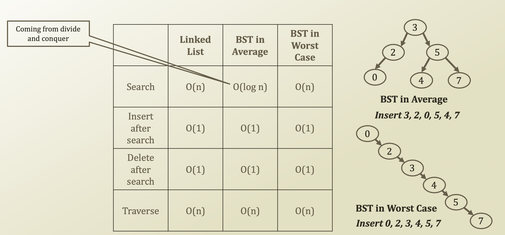

# 1. Priority Queue

## Detour: Performance of BST

## Priority Queue

* Queue with priorities
  * Element who has priorities in the enqueue operation
  * Naturally, the element with the priority will be dequeued with the priority as well
* In other words
  * Cutting in the line
  * VIP service

## Operations of Priority Queue

* Previously in queues
  * Enqueue an element
* Now in priority queues
  * Enqueue an element with a priority
  * Priority in the priority queue context
    * In our definition, let's say
      * Higher value = higher priority
      * Lower value = lower priority
* Therefore, the interface of the priorirty queue will be
  * enqueue\(element, key\)
  * Rather, enqueue\(element\) in queue

