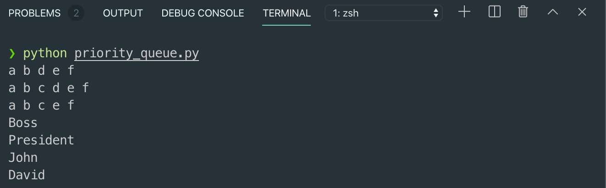
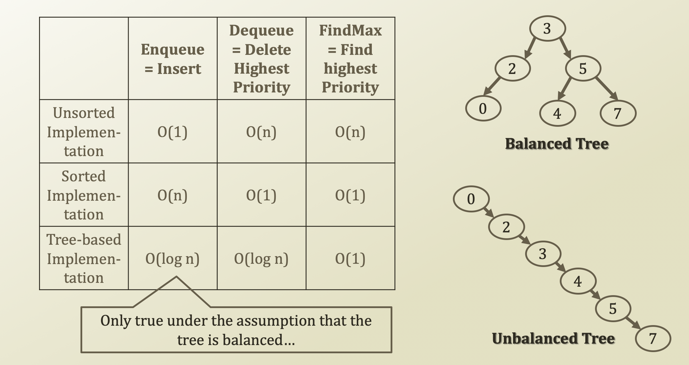

# 2. Implementation & Performance of Priority Queue

## How to Implement Priority Queues

* Using the linked list as the basis of the priority queue
  * Store the element as well as the prioirty
  * Then, two approaches to implement the priority queue
    * Lazy approach = Unsorted Implementation
      * When there is an enqueue event, just insert the element and the priority value at the end of the queue
      * When there is a dequeue event, remove the element with the highest priority by searching the queue from the beginning to the end
    * Early-bird approach = Sorted Implementation
      * When there is an enqueue event, insert the element and the priority at the position that starts a sequence of elements with lower priorities
      * When there is a dequeue event, remove the element at the front of the queue

## Implementation of Priority Queues

* Sorted Implementation
  * Enqueue\(node, priority\)
    * current = head
    * While current.next\( \).getPriority\( \) &gt; priority:
      * current = current.next\( \)
      * Index = current.getIndex\(\)
    * Insert
      * At index
      * PriorityQueueNode\(value, priority\)
* Unsorted Implementation
  * Have to change the dequeue method



```python
from singly_linked_list import SinglyLinkedList

class PriorityNode:
    priority = -1
    value = ''

    def __init__(self, value, prioirty):
        self.value = value
        self.priority = prioirty
    def getValue(self):
        return self.value
    def getPriority(self):
        return self.priority

class PriorityQueue:
    lst = ''
    
    def __init__(self):
        self.lst = SinglyLinkedList()

    def enqueueWithPriority(self, value, priority):
        idxInsert = 0
        for i in range(self.lst.getSize()):
            node = self.lst.get(i)
            if node.getValue() == '':
                idxInsert = i
                break
            if node.getValue().getPriority() < priority:
                idxInsert = i
                break
            else:
                idxInsert = i + 1
        self.lst.insertAt(PriorityNode(value, priority), idxInsert)

    def dequeueWithPriority(self):
        return self.lst.removeAt(0).getValue()

pq = PriorityQueue()
pq.enqueueWithPriority("David", 1)
pq.enqueueWithPriority("President", 10)
pq.enqueueWithPriority("John", 2)
pq.enqueueWithPriority("Boss", 99)

print(pq.dequeueWithPriority())
print(pq.dequeueWithPriority())
print(pq.dequeueWithPriority())
print(pq.dequeueWithPriority())
```



```python
from node_implementation import Node

class SinglyLinkedList:
    nodeHead = ''
    nodeTail = ''
    size = 0

    def __init__(self):
        self.nodeTail = Node(binTail = True)
        self.nodeHead = Node(binHead=True, nodeNext=self.nodeTail)
    
    def insertAt(self, objInsert, idxInsert):
        nodeNew = Node(objValue = objInsert)
        nodePrev = self.get(idxInsert - 1)
        nodeNext = nodePrev.getNext()

        nodePrev.setNext(nodeNew)
        nodeNew.setNext(nodeNext)
        self.size += 1

    def removeAt(self, idxRemove):
        nodePrev = self.get(idxRemove - 1)
        nodeRemove = nodePrev.getNext()
        nodeNext = nodeRemove.getNext()

        nodePrev.setNext(nodeNext)
        self.size -= 1
        return nodeRemove.getValue()

    def get(self, idxRetrieve):
        nodeReturn = self.nodeHead
        for itr in range(idxRetrieve + 1):
            nodeReturn = nodeReturn.getNext()
        return nodeReturn
    
    def getSize(self):
        return self.size
    
    def printStatus(self):
        nodeCurrent = self.nodeHead
        while nodeCurrent.getNext().isTail() == False:
            nodeCurrent = nodeCurrent.getNext()
            print(nodeCurrent.getValue(), end = ' ')
        print('')
        
list1 = SinglyLinkedList()
list1.insertAt('a', 0)
list1.insertAt('b', 1)
list1.insertAt('d', 2)
list1.insertAt('e', 3)
list1.insertAt('f', 4)
list1.printStatus()

list1.insertAt('c', 2)
list1.printStatus()

list1.removeAt(3)
list1.printStatus()
```



```python
class Node:
    nodeNext = None
    nodePrev = ''
    objValue = ''
    binHead = False
    binTail = False

    def __init__(self, objValue='', nodeNext=None, binHead=False, binTail=False):
        self.nodeNext = nodeNext
        self.objValue = objValue
        self.binHead = binHead
        self.binTail = binTail
    
    def setValue(self, objValue):
        self.objValue = objValue
    def getValue(self):
        return self.objValue
    
    def setNext(self, nodeNext):
        self.nodeNext = nodeNext
    def getNext(self):
        return self.nodeNext

    def isHead(self):
        return self.binHead
    def isTail(self):
        return self.binTail
    
node1 = Node(objValue = 'a')
nodeTail = Node(binTail=True)
nodeHead = Node(binHead=True, nodeNext=node1)
```





## Performances of Priority Queue Implementations



