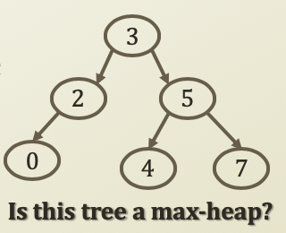
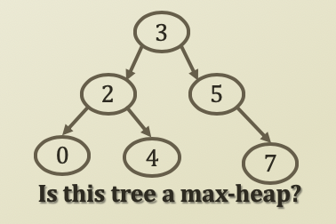
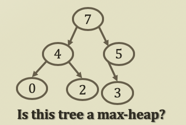

# 4. Binary Heap for Priority Queue

## Binary heap for Priority Queue

* Prioirty queue implementation
  * Linked list based implementation
    * Sorted implementation
    * Unsorted implementation
  * Tree based implementation
    * Since if tree is unbalanced, it's not different as linked list because of same complexity O\(n\), tree should be balanced to justify the reason of using trees
* Binary heap is a binary tree \(2 -&gt;LHS, RHS\) with two properties
  * The shape property
    * The tree is a complete tree
  * The heap property
    * \(Max-heap property\) Each node is greater than or equal to each of its children
    * Max-heap since we defined a higher priority has a higher value

### Since we know higher property has a higher value, when we pop of the highest value, we can pop on the top.

