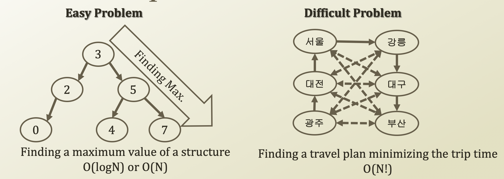
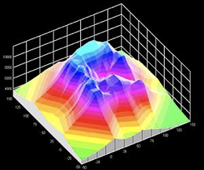

# 1. Difficult Problem

## A Difficult Problem

* What makes a problem difficult?
  * Diffficulty in implementing an algorithm?
    * No
  * Diffficulty in understanding an algorithm?
    * No
  * Difficulty in calculating a solution in a given time, or your lifetime...
    * Yes
* Imagine your algorithm solves a problem size X in a month...
  * With O\(N!\) complexity
  * If you increase the size to \(X + 1\), then now it takes \(X + 1\) month to solve it 

## Search Space and Global Optimum

* Optimization is tightly linked to space search
  * Finding a maximum \(a type of optimum\) in a binary search tree
    * Search through a BST following a pre-defined paths
    * The data structure is a safe path with a consistency, keeping the assumptions
* What-if there is no paths, just a big list sizing N!
  * Searching a record with a record must not be feasible
    * Because we only know very beside to us
  * The list is not structured with a pattern
    * **No deterministic ways to search the space**

