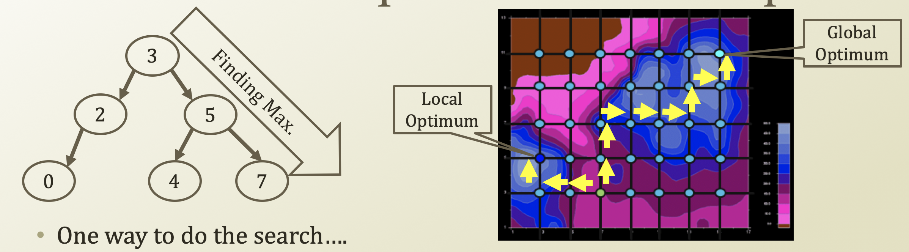
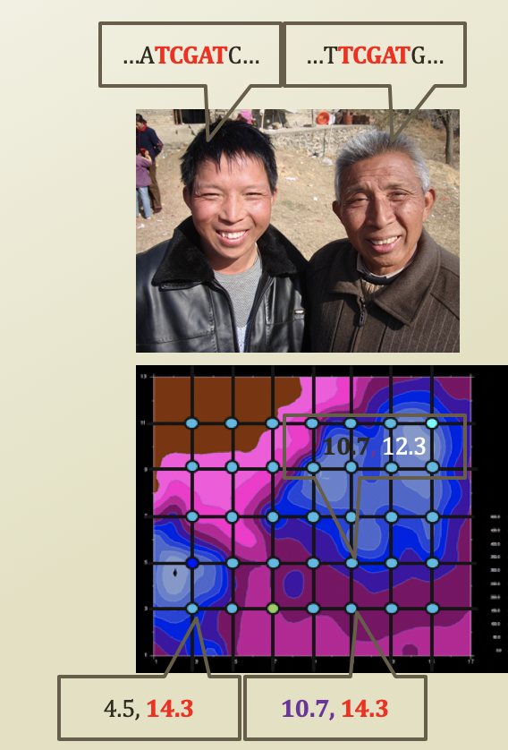

# 2. Genetic Algorithm

## Heuristic based Optimization Techniques

* One way to do the search
  * Follow the higher neighbor until the search hit no way to go 
  * Called Hill-climbing heuristics or gradient-ascent heuristics
  * Problem?
    * Okay, that is the highest place around the search
    * But, not to entire map
    * Falling into a local optimum
  * Why does hill-climbing have a trouble of falling into a local optimum?
    * Because it only tries to find highest place around of it
  * Then, is there any other heuristics?

## Learning From The Naturee

* Survival of the fittest by Herbert Spencer
* Natural selection by Charles Darwin
* Who gets to be chosen by the nature?
  * Someone who is the optimal in surviving the environment
  * Giraffe in the forest
  * By the way
    * What is selected?
    * The giraffe or the gene of the giraffe

## Genetic Algorithm

* Gene
  * Is an element consisting of geenotype
* Genotype is the identify of an entity
  * Genotype of fan individual: ...A**TCGAT**C...
  * Genotype of a location \(Encoding\):
    * \(10.7, 12.3\)
* Phenotype is the observation on an entity
  * Phenotype of an individual: the look of his face
  * Phenotype of a location: the altitude of the location
* Fittest phenotype → Optimal value
* Driving genotype → Optimal solution
* ∴ To get genotype, solve phenotype first

​

