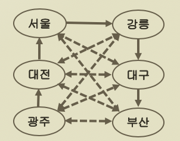
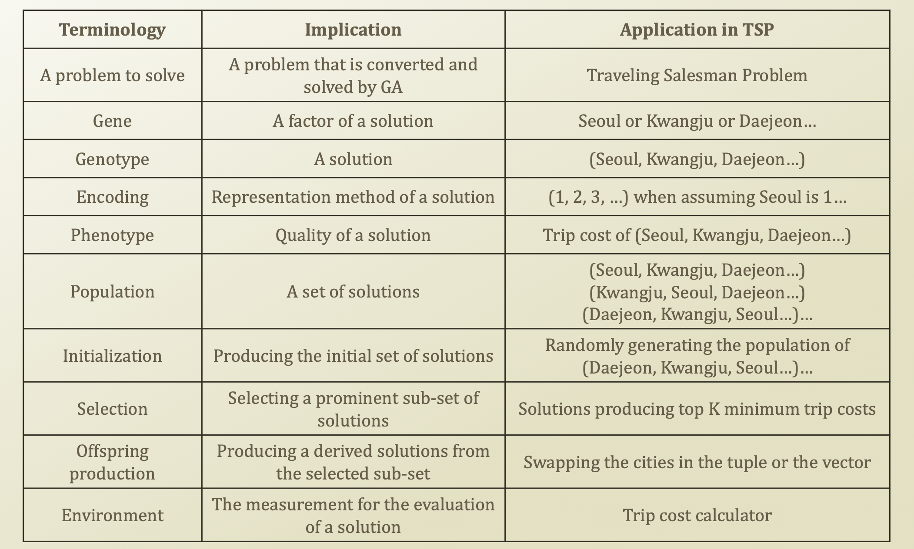

# 3. Traveling Salesman Problem

## Example of Difficult Problems: Traveling Salesman Problem \(TSP\)

* There is a traveling salesman in a county
  * He has a big trunk where he stores his goods
    * He sells watches, jewelries, chocolates...
    * A job throughout a great depression...
  * He needs to visit as much as city possible
  * He needs to conserve his travel money \(Phenotype\)
* His travel choice ranges from
  * Seoul, Kangleung, Daeejeon, Daeegu, Gwangju, Pusan
    * → Genotype
  * How many possible choices?
    * O\(N!\)
* Traveling Salesman Problem \(TSP\)
  * A common problem in Supply Chain Management \(SCM\) and logistics
  * A search among N! possible cases
  * Finding the cheapest route passing through all of the cities
  * Therefore, we need very smart heuristic

## Terminology of Genetic Algorithm

