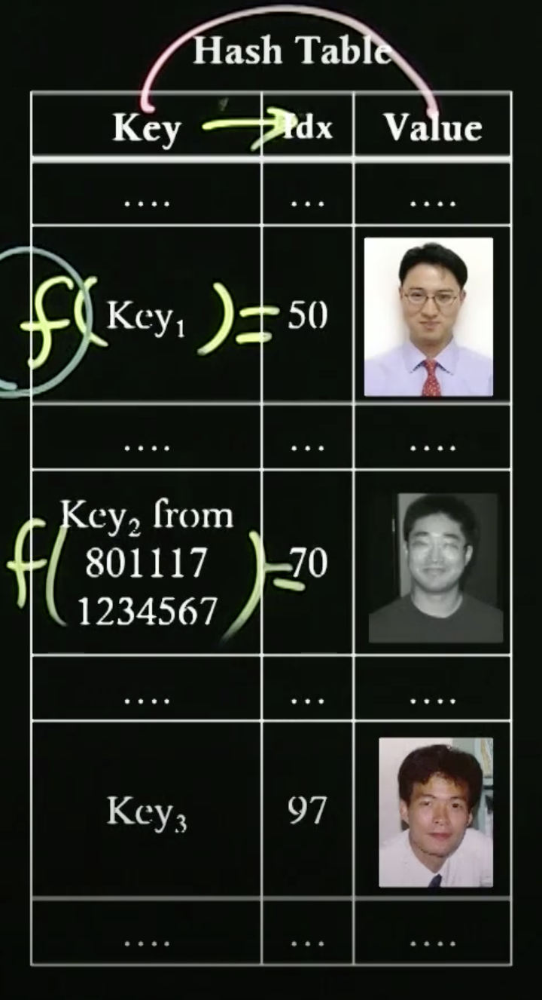

# 2. Hash Table

## Hash Table

* A large size of tables consisting of keys and values
  * **Hash Function** is used to find an **array index** for a key
  * Definition
    * An array index: an index in the table
    * A key: a **unique identifier** of a value, an input parameter to find its array index through hash functions
    * A value: a stored value
  * Characteristic
    * One key can be associated with one index
      * Function definition
    * One index can be associated with multiple keys
      * Onto function
      * A collision occurs in this case → How to solve it?
* An array element = a slot = a bucket

