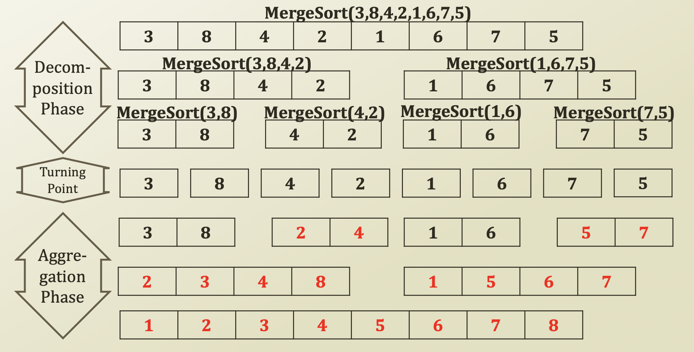

# 2. Merge Sort

## O\(NlogN\) Sorting

* Sorting Algorithm
  * Worst case O\(N²\) or O\(NlogN\) sorting
  * **If good division**, average case O\(NlogN\) sorting
  * With a **divide-and-conquer** approach
  * Divide the target sequence into multiple sequences
    * Recursively perform sorting of the sub-sequences
    * The problem is 
      * How to divide
* Variants
  * Quick Sort
  * Heap Sort
  * **Merge Sort**
* Pros and Cons?
  * Cons: bad division \(worst case division\) leads into O\(N²\) time complexity
  * Pros: relatively good time complexity

## Merge Sort

* Merge Sort: One example of recursive programming
  * Decompose into two smaller lists
  * Aggregate to one larger and sorted list

* 4 번째 줄에서 5 번째 줄 가는 과정 중 3 과 8 을 비교할 때 3 이 더 작으므로 8은 그대로 내려온다. 즉 비교할 필요없이 gain 이 발생한다.
* 마찬가지로, 4 와 2를 비교할 때 2 가 더 작으므로 앞에 쓰이고 4 는 그대로 내려온다. 마찬가지로 gain 이 발생한다.
* 5 번째 줄에서 6 번째 줄로 가는 과정 중 3,8 과 2,4 를 비교할 때 먼저 3과 2를 비교하여 2가 더 작으므로 앞으로 가고 이제 3은 4와 비교한다. 3은 4보다 작으므로 앞으로 가고 이제 4는 8과 비교한다. 4는 더작으므로 앞으로 간다. 8은 그대로 마지막에 쓰여 gain 이 발생한다.

