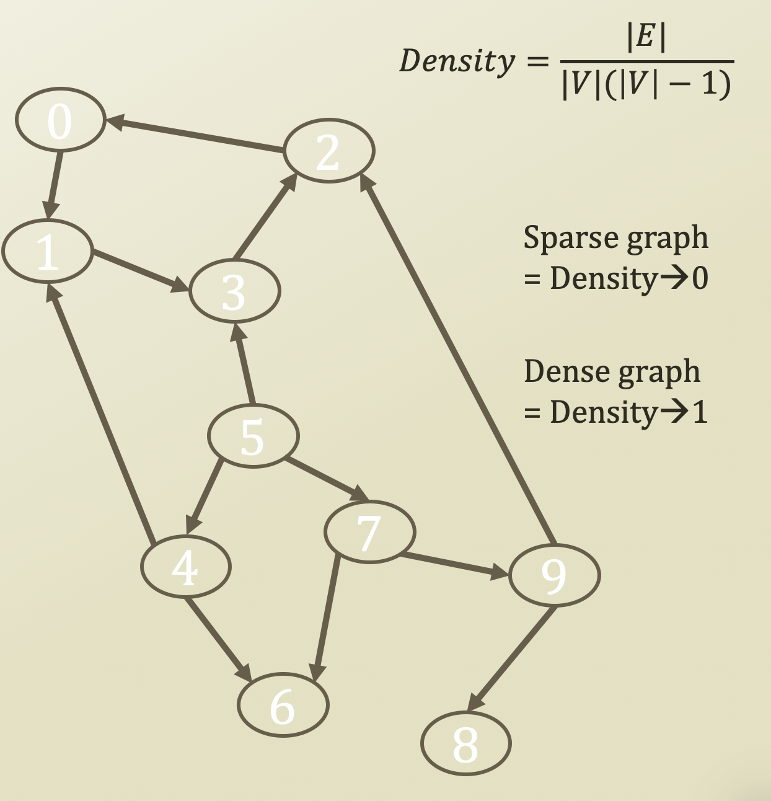
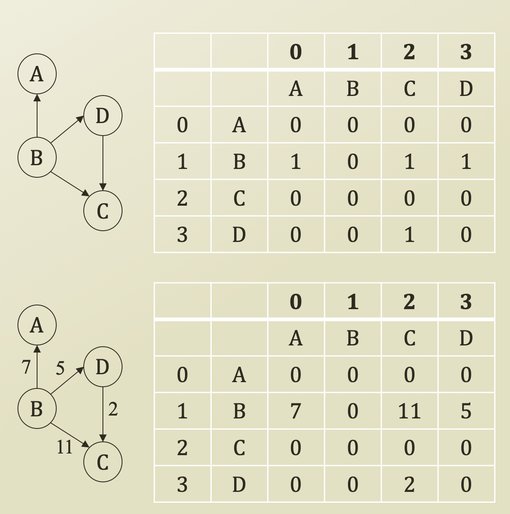
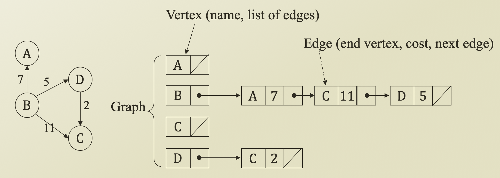

# 2. Representation of Graph

## Data Structures for Graphs

* To store a graph
  * Store a set of vertices
    * 0, 1, 2, 3, 4, 5, 6, 7, 8, 9
  * Store a set of edges
    * \(0, 1\), \(1, 3\), \(2, 0\), \(5, 3\) ...
* How to store?
  * Storing vertices
    * Simple
    * Linked list, BST, Hash ...
  * Store edges
    * Fundamentally, a pair of values
    * There is the 2 methods to store edges
      1. Initially, a two-dimensional matrix

         1. Space: O\(V²\)
         2. Time: O\(1\)

         However, Graph density becomes a problem

      2. So, Adjacency list
         1. Space: O\(E\)
         2. Time: O\(E\)

## Matrix Representation for Dense Graph

* Array Representation:
  * Adjacency Matrix
* Linked Representation:
  * Adjacency List
* Adjacency Matrix
  * A\[i\]\[j\] = 1 if \(vᵢ, vⱼ\) ∈ E
    *   = 0 otherwise
* Adjacency Matrix for weighted graph
  * Edge weight value instead of 0/1
* If a graph is dense graph, adjacency matrix is a good method
* However, if a graph is sparse graph, since there is a lot of 0, adjacency matrix has waste of storage because of O\(V²\)

## Adjacency List Representation for Sparse Graph

* Adjacency matrix: Storage waste for sparse graph
* Adjacency list
  * For each vertex, make a linked list of edges starting from the vertex
    * You can use a linked list, BST, Hash, ..., but in this class, we will use the linked list
  * Edge weight can be stored in 'Edge′
  * Storage efficient
  * It is good for a sparse graph, so good for saving the storage
* Cons?
  * Although adjacency matrix takes O\(1\), adjacency list takes  O\(E\)

