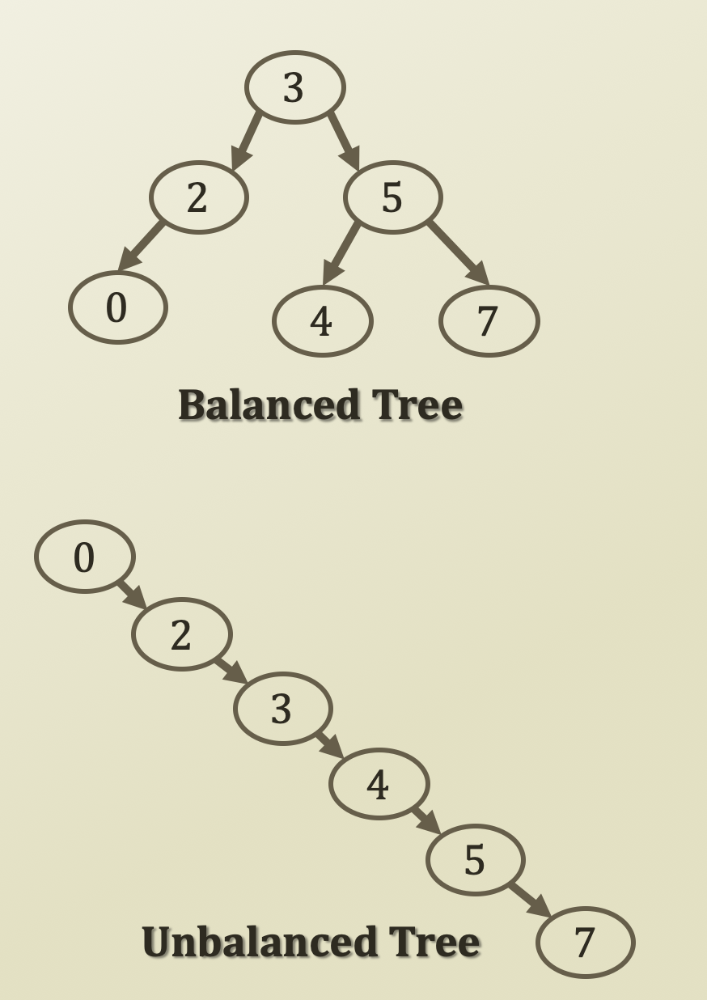

# 3. Balanced Tree

## Balanced Tree

* Balanced tree
  * If its size is n,
    * $$n \leq 2^{h+1} -1$$ 
    * 6 nodes in a tree of height 2
    * By the way, height = maximum path length
      * Correct: $$6 \leq 2^{2+1} - 1 = 2^3 - 1 = 7$$ 
    * 6 nodes in a tree of height 5
      * Correct: $$6 \leq 2^{5+1} - 1 = 2^6 - 1 = 63$$ 
  * What if 
    * $$2^h - 1 < n \leq 2^{h+1}-1$$ 
    * i.e., 2ʰ - 1 &lt; n means tree with height h - 1 cannot store n and 
    * n ≤ 2ʰ⁺¹ - 1 means tree with height h can store n
    * So, n should be at least height h. If height is h - 1, then the tree cannot store n 
    * 6 nodes in a tree of height 
      * $$2^2 - 1 < 6 \leq 2^{2 + 1} - 1$$ 
      * Correct: 3 &lt; 6 ≤ 7
    * 6 nodes in a tree of height 5
      * $$2^5 - 1 < 6 \leq 2^{5+1} - 1$$ 
      * Incorrect: 31 &lt; 6 ≤ 63
* Complete tree ⇒ balanced tree
  * Yes
  * By the way, complete tree is all nodes are full except leaves. Then leaves are fulfilled from the left
* Balanced tree ⇒ complete tree
  * No
  * In the above figure, first picture is balanced tree, but it's not complete tree because it is not fulfilled from the left

