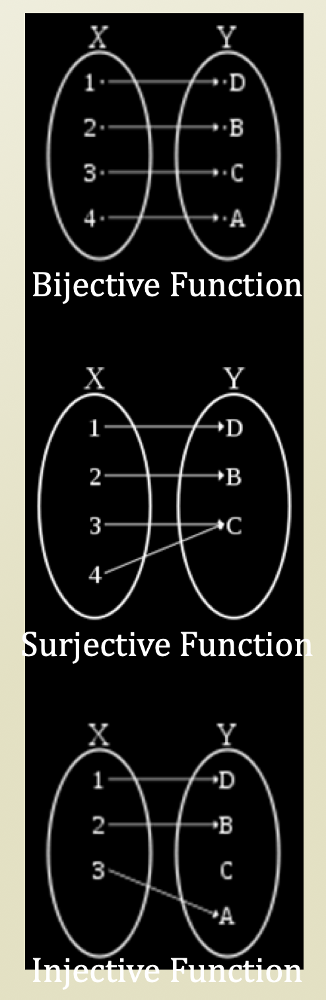

# 3. Hash Function

## Hash Function

* A hash function is used to convert
  * Value's key → Array's index
  * For example, ff\(8011171234567\) = 3
    * 801117123456789 = a person's register number
    * 3 = an index where the person is stored
    * f = a hash function
* Perfect hash function \(ideally\)
  * Either, if we have an unlimited space
  * Or, if we have a limited input size
  * We might have a chance to create a bijective hash function
    * However, you have to know the characteristic of keys
* Good hash function
  * Hash function resulting in a **uniform distribution**
    * Why is this a good hash function?
      * Because biased distribution has so many collisions, but uniform distribution has small collisions
    * Why is this difficult?
      * Because it's difficult to make a uniform hash function and as input size large as, the graph goes to bell-shaped
    * Pseudo-random
    * Any relation to the password encryption algorithm?
  * Low cost, determinism, variable range...

