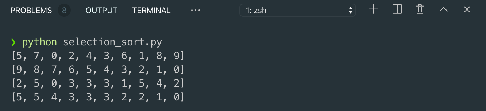

# 1. O\(N²\) Sorting

## Sorting

* [https://www.toptal.com/developers/sorting-algorithms
  ](https://www.toptal.com/developers/sorting-algorithms
  )
* Without a manipulation on data
  * Just a chunk of data is useless to users
  * Data should be structured ofr
    * Users
      * Data display
      * Maybe, sorted table
    * Computers
      * Data structure
      * Maybe, heap, BST, hash ...
  * Most of human decisions asks
    * Best case
    * Worst case
    * Sorting!

## O\(N²\) Sorting

* Sorting Algorithm
  * Worst case O\(N²\) sorting
  * Without a divide-and-conquer approach
  * Sequential comparisons with two index iterations
    * Usually there is a nested loop that ranges
      * Outer loop: from the first to the end
      * Inner loop:
        * From the outer loop's index to the end
        * Or, from the first to the outer loop's index
  * Variants
    * Insertion Sort
    * Selection Sort
    * Bubble Sort
  * Pros and Cons?
    * Cons: time complexity
    * Pros?
      * Easy to implement

## Selection Sort Algorithm

* Examples of Algorithms
  * Insertion, deletion, search of linked lists, stacks, queues
  * Sorting of linked lists
    * Various sorting methods
      * Bubble sort, Quick sort, Merge sort
* Selection Sort \(list\)
  * For itr1 = 0 to length\(list\)
    * For itr2 = itr1 + 1 to length\(list\)
      * If list\[itr1\] &lt; list\[itr2\]
        * Swap list\[itr1\], list\[itr2\]
  * Return list
* This program uses
  * Data structure: list
  * Algorithm: Selection sort

```python
import random

def performSelectionSort(lst):
    for itr1 in range(0, len(lst)):
        for itr2 in range(itr1+1, len(lst)):
            if lst[itr1] < lst[itr2]:
                lst[itr1], lst[itr2] = lst[itr2], lst[itr1]
    return lst

N = 10
lstNumbers = list(range(N))
random.shuffle(lstNumbers)

print(lstNumbers)
print(performSelectionSort(lstNumbers))

lstNumbers2 = [2, 5, 0, 3, 3, 3, 1, 5, 4, 2]
print(lstNumbers2)
print(performSelectionSort(lstNumbers2))
```




