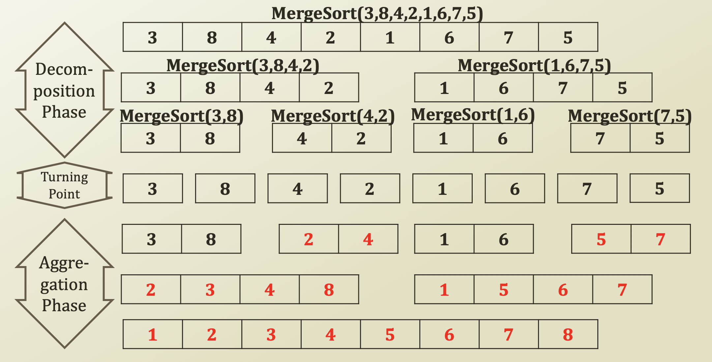

# 2. Merge Sort

## O\(NlogN\) Sorting

* Sorting Algorithm
  * Worst case O\(N²\) or O\(NlogN\) sorting
  * **If good division**, average case O\(NlogN\) sorting
  * With a **divide-and-conquer** approach
  * Divide the target sequence into multiple sequences
    * Recursively perform sorting of the sub-sequences
    * The problem is 
      * How to divide
* Variants
  * Quick Sort
  * Heap Sort
  * **Merge Sort**
* Pros and Cons?
  * Cons: bad division \(worst case division\) leads into O\(N²\) time complexity
  * Pros: relatively good time complexity

## Merge Sort

* Merge Sort: One example of recursive programming
  * Decompose into two smaller lists
  * Aggregate to one larger and sorted list



* 4 번째 줄에서 5 번째 줄 가는 과정 중 3 과 8 을 비교할 때 3 이 더 작으므로 8은 그대로 내려온다. 즉 비교할 필요없이 gain 이 발생한다.
* 마찬가지로, 4 와 2를 비교할 때 2 가 더 작으므로 앞에 쓰이고 4 는 그대로 내려온다. 마찬가지로 gain 이 발생한다.
* 5 번째 줄에서 6 번째 줄로 가는 과정 중 3,8 과 2,4 를 비교할 때 먼저 3과 2를 비교하여 2가 더 작으므로 앞으로 가고 이제 3은 4와 비교한다. 3은 4보다 작으므로 앞으로 가고 이제 4는 8과 비교한다. 4는 더작으므로 앞으로 간다. 8은 그대로 마지막에 쓰여 gain 이 발생한다.

## Implementation Example: Merge Sort

```python
import random

def performMergeSort(lstElements):
    # Base Case. Termination Term
    if len(lstElements) == 1:
        return lstElements
        
    # Decomposition
    lstSubElements1 = []
    lstSubElements2 = []
    for i in range(len(lstElements)):
        if len(lstElements) / 2 > i:
            lstSubElements1.append(lstElements[i])
        else:
            lstSubElements2.append(lstElements[i])
    
    # Recursion
    lstSubElements1 = performMergeSort(lstSubElements1)
    lstSubElements2 = performMergeSort(lstSubElements2)
    
    # Aggregation
    idxCount1 = 0
    idxCount2 = 0
    for i in range(len(lstElements)):
        if idxCount1 == len(lstSubElements1):
            lstElements[i] = lstSubElements2[idxCount2]
            idxCount2 += 1
        elif idxCount2 == len(lstSubElements2):
            lstElements[i] = lstSubElements1[idxCount1]
            idxCount1 += 1
        elif lstSubElements1[idxCount1] > lstSubElements2[idxCount2]:
            lstElements[i] = lstSubElements2[idxCount2]
            idxCount2 += 1
        else:
            lstElements[i] = lstSubElements1[idxCount1]
            idxCount1 +=1
    return lstElements
        
# Execution Code
lstRandom = []
for i in range(0, 10):
    lstRandom.append(random.randrange(0, 100))
print(lstRandom)
lstRandom = performMergeSort(lstRandom)
print(lstRandom)
```


