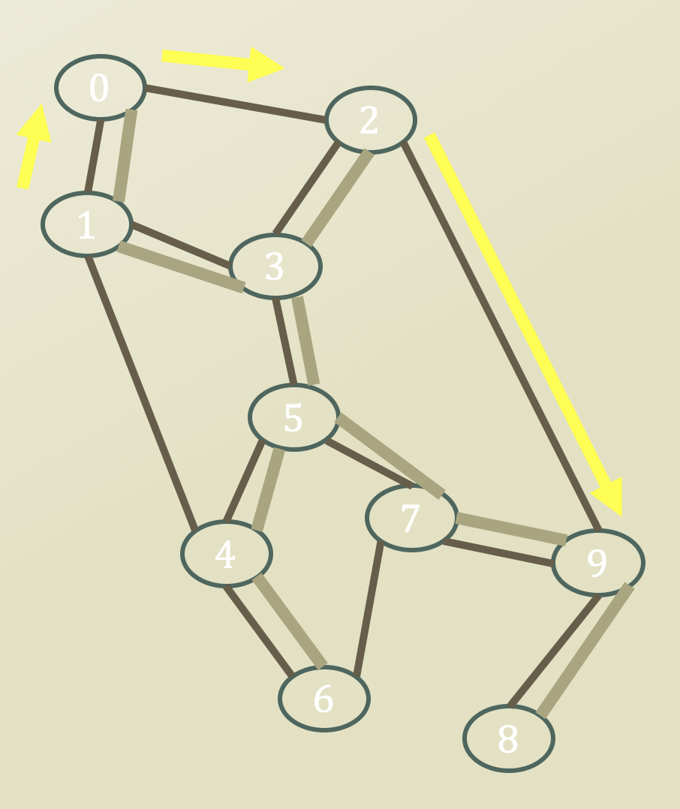
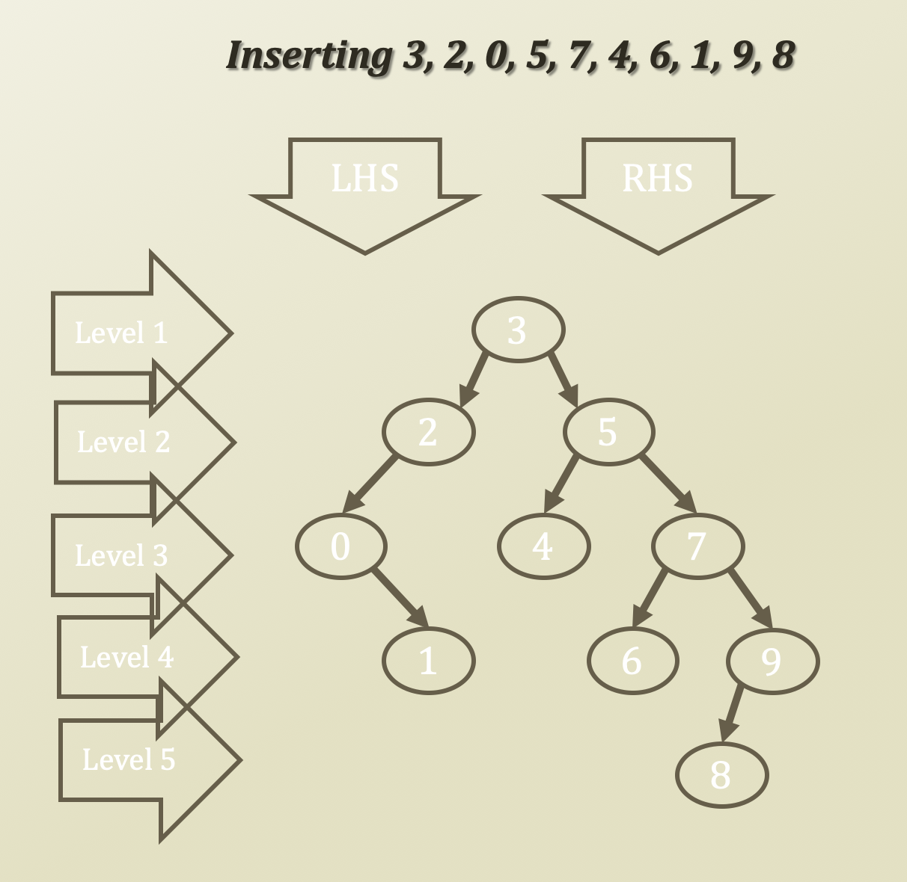
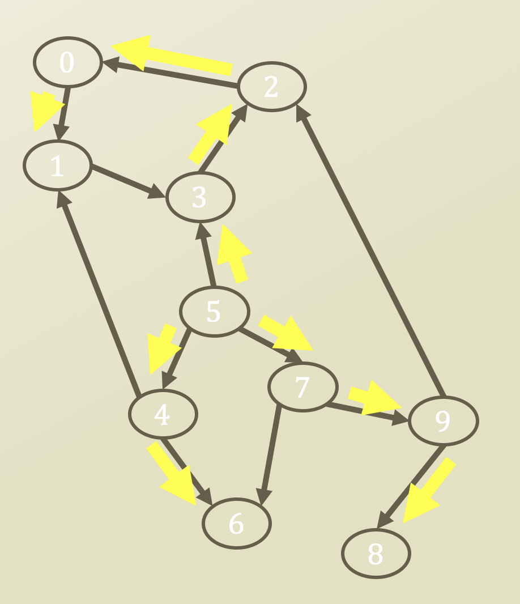
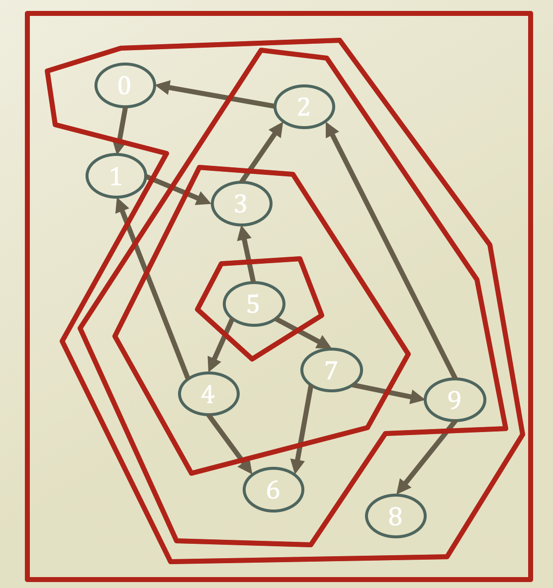

# 3. Traversing Problem - DFS and BFS

## Operations of Graph Data Structures

* Operations on graphs
  * Operation of retrieving vertices
    * BFS Traverse
    * DFS Traverse
  * Operation of finding shortest paths
    * The shortest path
      * From vertex 1
      * To vertex 9
  * Operation of finding a set of **path** to control **whole vertices**
    * The minimum spanning tree

## Detour: Tree Traversing

* Tree
  * Complicated than a list
  * Multiple ways to show the entire dataset
    * If it were a list
      * Just show the values from the beginning to the end
    * Since this is a BST
      * You have to choose what to show at a time
        * The value in LHS
        * The value in RHS
        * The value that you have
* Hence there are multiple traversing approaches

## DFS v.s. BFS Traverse on Graphs

* DFS uilizes
  * Stacks, or recursions that imitate the stack operations
  * Pre-order traverse
  * ~~In-order traverse~~
  * Post-order traverse
  * In graphs, often only pre-order traverse is used

* BFS utilizes
  * Queue
  * Level-order traverse

* Enqueue: 5 
* Dequeue: 5                Enqueue: 3, 4, 7
* Dequeue: 3                Enqueue: 4, 7, 2
* Dequeue: 4                Enqueue: 7, 2, 6
* Dequeue: 7                Enqueue: 2, 6, 9
* Dequeue: 2                Enqueue: 6, 9, 0
* Dequeue: 6                Enqueue: 9, 0
* Dequeue: 9                Enqueue: 0, 8
* Dequeue: 0                Enqueue: 8, 1
* Dequeue: 8                Enqueue: 1
* Dequeue: 1
* BFS: 5 3 4 7 2 6 9 0 8 1

* Having said this,
  * Tree is a directed acyclic graph
  * A graph may not be a DAG
  * Then
    * You have to check the repeated visits to avoid falling into a cycle

