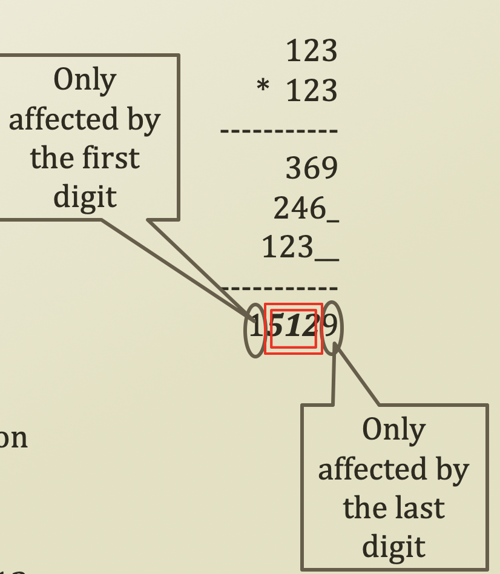

# 4. Examples of Hash Function

## Modulo Based Hash Function

* Modulo based hash function
  * We divide a numeric key with a number
    * Often, a number = the size of the has table
  * We take the remainder as an array index
  * Fore example,
    * Index = Key **mod** Size
    * 34567 = 8011171234567 **mod** 50000
  * Why is this often used?
    * Low cost
      * Because modulo is easy
    * Good variable range
      * when key % num,
      * range is \[0, num - 1\]
    * Appears to be uniform
      * But, actually it is not
  * Still, surjective function
  * The problem is if there is 17 and size of table is 10, then f\(17\) % 10 = 7. It's only use 0 digit of 17. Not use all of them
  * For example, if there is 8011171234567, f\(8011171234567\) % 10 = 7, which means the modulo based hash function doesn't use unique identifier much. It's only use 0 digit. That means it's getting far from unique distribution
  * How can we use a unique identifier, then?
    * Square based hash function

## Square Based Hash Function

* Square based hash function
  * Or, mid-square hash function
  * The problem of the modulo operation 
    * Under-utilizing available information
    * The quotient is not used
  * Therefore, we perform a mid-square method
    * First, square the key value
    * Second, take the N digits in the middle
    * Third, apply the selected digits to the modulo operation
  * For example,
    * Key = 123, Table size = 100, Mid-square digits = 3
    * f\(123\) = mid-square\(123\) mod 100 = 512 mod 100 = 12
  * Square based hash function has a higher cost than modulo based hash function, but it's still low cost
  * Good range
  * It's more uniform distribution than modulo based hash function because it used more numbers
* Still utilizing the modulo operation at the end
  * Why?

## Digit Analysis Based Hash Function

* Digit Analysis
  * A.k.a. **checksum** \(old file v.s. new file\) hash function
  * Looks pretty stupid way
  * But works pretty well
* Procedure of the function calculation
  * One checksum method
    * First, take all the digits and sum of them
    * Second, apply the modulo operation to the summation of the digits
  * For example,
    * Key = 8011171234567, Table size = 100
    * f\(8011171234567\) = \(8 + 0 + 1 + 1 + 1 + 7 + 1 + 2 + 3 + 4 + 5 + 6 + 7\) mod 100 = 46 
* Low cost?
  * Yes
* Range?
  * Good
* Uniform distribution?
  * Since every number is used, it's good uniform distribution

