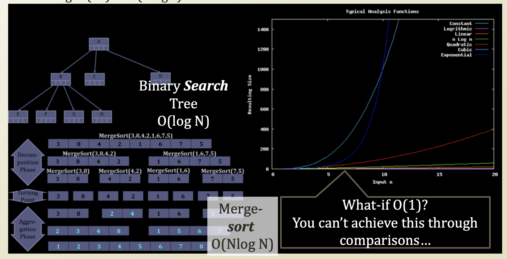
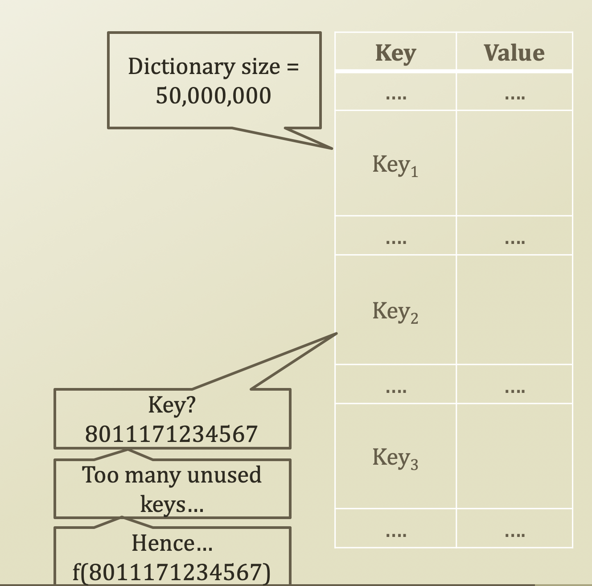

# 1. Limit of Divide and Conquer

## Limit of Divide and Conquer

* The limitation of divide and conquer \(BST, Merge sort, ...\)
  * If the divide and conquer is based upon a comparison
    * The efficiency is limited to the logarithm of the problem size
      * Search: O\(N\) → O\(logN\)
      * Sorting: O\(N²\) → O\(NlogN\)
    * The problem start here: However, if the data size is very huge, then logarithm also goes big number too.
    * What if O\(1\)? I.e., do not compare?

## Cheap Storage Cost and Expensive Time Cost

* Searching and sorting without comparisons...
  * Because time is gold
  * With cheap storage spaces, memory and disk
* Let's image that we are storing the information of the whole population of Korea
  * About 50,000,000 individuals
  * Are they uniquely identifiable?
    * Yes, by the registration number system
    * Similarly, bank accounts are identified by account numbers
* Then, why not store the individual's information in 
  * A dictionary in Python
  * Key and value
    * Key: registration numbers?
    * Value: my information′
* Unlimited storage space?
  * Probably not

