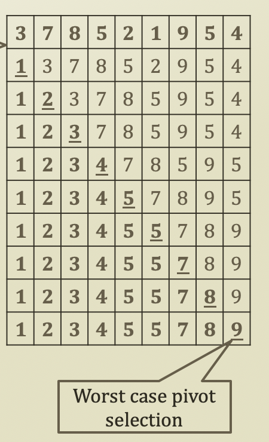
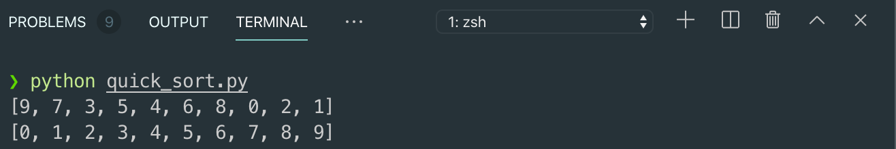

# 4. Quick Sort

## Quick Sort

* Basic Idea
  * QuickSort\(Sequence\)
    * Given a sequence
    * Select a **pivot**
      * **Pivot** = a threshold to divide the sequence into two sub-sequences
    * Divide the sequence into two sub-sequences
      * Sequence with values less than the pivot
      * Sequence with values greater than the pivot
    * Return
      * QuickSort\(sequence with less\) + Pivot + QuickSort\(sequence with greater\)
  * By the way, Merge sort forces to divide the sequence in the middle
    * Always the similar sizee of the sub-sequences
  * However, QuickSort depends on which pivot you choose
  * This divides the sequence with the pivot selection


## Importance of Pivot in Quick Sort

* What-if the pivot is biased
  * Let's assume that
    * Pivot is always the smallest number
    * Then?
      * Just another selection sort
  * Same to the O\(N²\) sorting algorithms
  * Hence the pivot selection is important
  * Pivot selection approach
    * Median
    * Random
* Particularly, Merge sort is more preferable because?
  * Doesn't have to worry about the pivot selection
* However, Quick sort is more easy to implement than Merge sort



## Implementation of Quick Sort

```python
import random

# Random Number Generation
N = 10
lstNumbers = list(range(N))
random.shuffle(lstNumbers)

def performQuickSort(seq, pivot = 0):
    # Base Case. Termination Term
    if len(seq) <= 1:
        return seq

    # Pivot Selection: always pick the first element
    pivotValue = seq[pivot]

    # Dividing the sequence into two pieces
    less = []
    greater = []
    for itr in range(len(seq)):
        if itr == pivot:
            continue
        elif seq[itr] > pivotValue:
            greater.append(seq[itr])
        elif seq[itr] <= pivotValue:
            less.append(seq[itr])
    
    # Recursive Calls
    ret = performQuickSort(less) + [pivotValue] + performQuickSort(greater)
    
    return ret

print(lstNumbers)
print(performQuickSort(lstNumbers))
```



