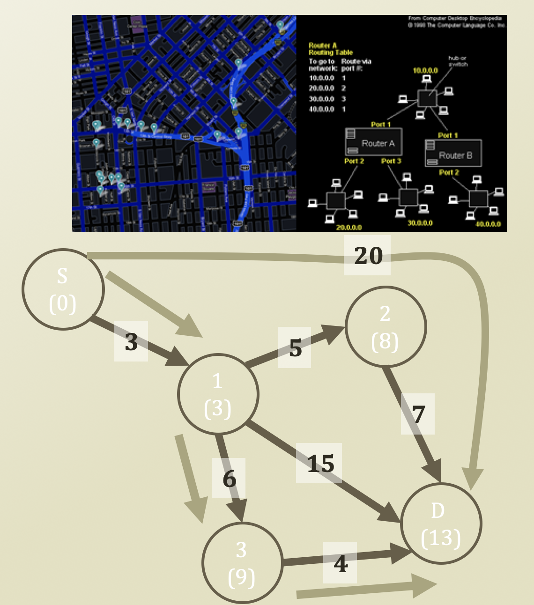

# 4. Shortest Path Problem - Dijkstra's Algorithm \(1\)

## Single-Source Shortest Path Problem

* One recurring problem in graph
* Happens in
  * Path finding
  * Routing on communication networks
  * Social Networks
* We know where we are
* We want to know how long to travel to our destinatin
* Terminology
  * Source: where we start
  * Destination: where we arrive

