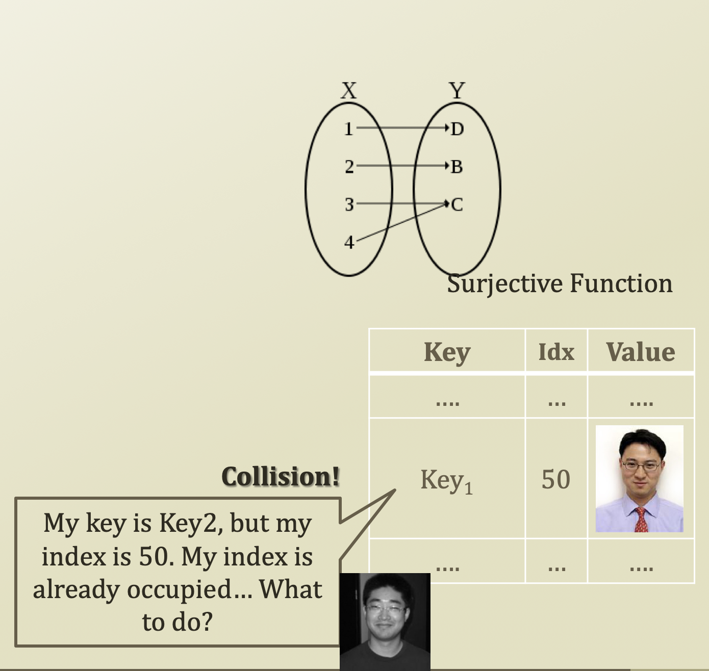

# 5. Collision Resolution of Hashing

## Collision Resolution of Hashing

* Load factor
  * Load factor is often the determinant of the hash performance
  * = N / S
    * N: Size of the stored entries
    * S: Size of the hash table
  * 좌측에 있는 값들은 모두 우측을 하나 가리켜야 하고, 우측에 있는 값들은 하나도 선택 못받거나, 하나이상 \(Collision 발생\) 선택받을 수 있다. 그러므로 0 ≤ load factor N / S ≤ 1
  * N 이 크고 S 가 작다는 것은 N 에 있는 원소들은 무조건 하나씩 가리켜야 하므로, load factor 가 크다고 할 수 있다 → collision 이 많이 발생할 확률이 높다.
  * Why is this important?
    * Related to one of the qualities of the hash function, or uniformity
    * Because of collision
      * Different keys with the same index
* Closed addressing
* Open addressing

## Collision Resolution by Closed Addressing

* Collision resolution by closed addressing \(Hash function 을 통해 같은 key 값을 얻었더라도 그냥 무조건 넣어보자\)
  * Separate Chaining
  * Live together approach

