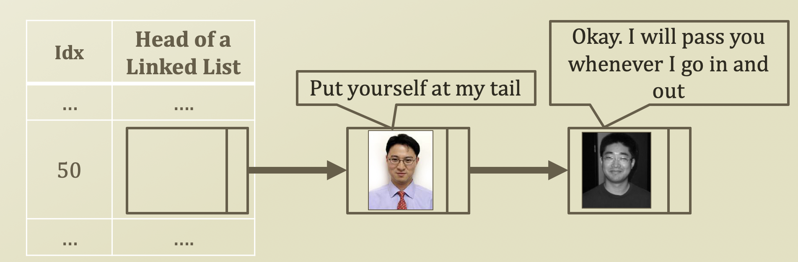
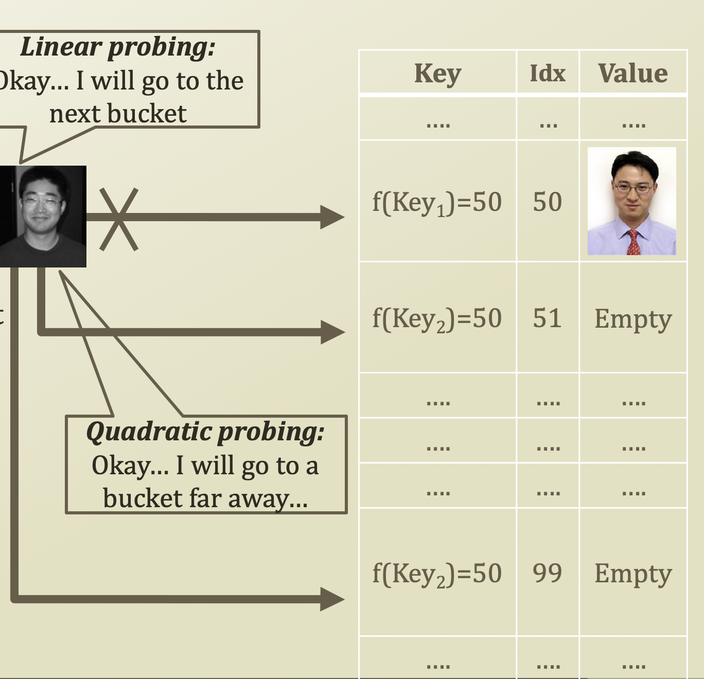

# 5. Collision Resolution of Hashing

## Collision Resolution of Hashing

* Load factor
  * Load factor is often the determinant of the hash performance
  * = N / S
    * N: Size of the stored entries
    * S: Size of the hash table
  * 좌측에 있는 값들은 모두 우측을 하나 가리켜야 하고, 우측에 있는 값들은 하나도 선택 못받거나, 하나이상 \(Collision 발생\) 선택받을 수 있다. 그러므로 0 ≤ load factor N / S ≤ 1
  * N 이 크고 S 가 작다는 것은 N 에 있는 원소들은 무조건 하나씩 가리켜야 하므로, load factor 가 크다고 할 수 있다 → collision 이 많이 발생할 확률이 높다.
  * Why is this important?
    * Related to one of the qualities of the hash function, or uniformity
    * Because of collision
      * Different keys with the same index
* Closed addressing
* Open addressing

## Collision Resolution by Closed Addressing

* Collision resolution by closed addressing \(Hash function 을 통해 같은 key 값을 얻었더라도 그냥 무조건 넣어보자\)
  * Separate Chaining
  * Live together approach
* The worst case scenario
  * Every entry has the same index from a stupid hash function
  * Just another linked list
* Considering the load factor
  * Load factor &gt; 1 is possible
    * Because in head of linked list, size of chaining could be larger than a hash table
    * This case means that every index has one ore more entries
    * Then? Only use the linked list for each bucket? Trees can be used as well

## Collision Resolution by Open Addressing

* Collision resolution by open addressing
  * Resolution by probing
    * See where an empty bucket is
    * I don't want to live with you, so get out and find your own place approach
  * Various probing
    * Linear probing - see whether the next bucket is empty or not
      * Index = \(f\(Key\) + i\) mod S
      * 처음 것이 꽉 차있으면 그 다음 것으로, 그 다음 것으로, ... i 번 이동
    * Quadratic probing
      * Index = \(f\(Key\) + i + i²\) mod S
      * 처음 것이 꽉 차있으면 그 다음 것 + 그 다음것² 으로, 두 번째 것도 꽉 차 있으면 그 다음 것 + 그 다음것²  으로 ...
    * i = number of trials
    * S = size of the hash table
    * Why do we use quadratic probing?
      * If data size is very big, although uniform distribution goes to bell-shaped. So send it to far away from fulfilling Key
      * Then, it's uniformly of a hash function 

​

