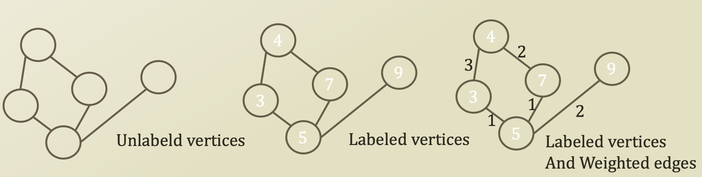
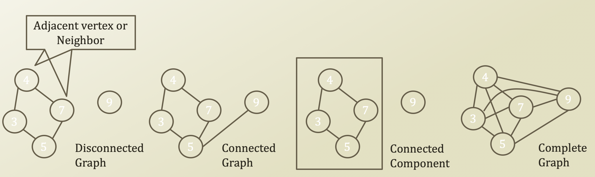
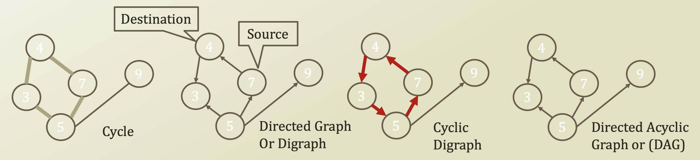

# 1. Graph

## Graphs

* Examples of ordering collections, where each item may have successors and predecessors:
  * List: one predecessor, one successor at most
  * Tree: one predecessor \(parent\), several successors \(children\)
  * Graph: several predecessors and successors
* Graph G = \(V, E\)
  * V = {vᵢ}: a finite non-empty set of vertices \(or nodes\)
  * E = {eᵢ}: a finite \(possibly empty\) set of edges \(or arcs\)
    * eᵢ connects two vertices in V

## Graph Terminology

* Adjacent, neighbor, incident
* **Path** between A and B: a sequence of edges connecting A and B
* **Connected Graph:** path from each to **every other** vertex
* **Connected Component:** graph subset containing the set of vertices reachable from a vertex and their edges
* **Complete Graph:** edge for every pair of vertices
  * Dense graph: close to complete graph
    * \|E\| = O\(\|V\|²\)
  * Sparse graph: far from complete graph
    * \|E\| = O\(\|V\|²\)

* **Cycle:** a path starting from a node and ending the node itself
* **Directed Edge:** an edge with direction \(source and destination\)
* **Digraph:** directed graph.
  * Graph with direct edges
* **DAG:** Directed Acyclic Graph
  * Directed graph without cycle

