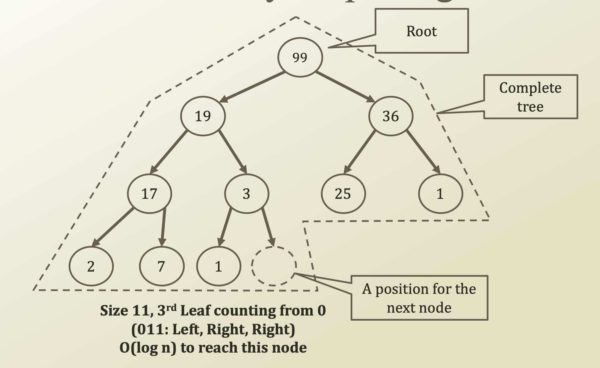

# 5. Reference Structure of Binary Heap

## Structure of Binary Heap Using Reference

* Except leaves, the tree is full tree. Then,
  * $$2^{h+1} - 1 = 2^{2 + 1} - 1 = 7 $$ 
  * Since size is 11,
  * 11 - 7 = 4
  * So, we know that position for the next node is 4th index, which is 3 starts from 0
  * Or, 3₁₀ = 011₂ 
  * Or, using traverse, if LHS is 0 and RHS is 1,
  * LHS, RHS, RHS ⇒ 011

## Structure of Binary Heap Using Array

