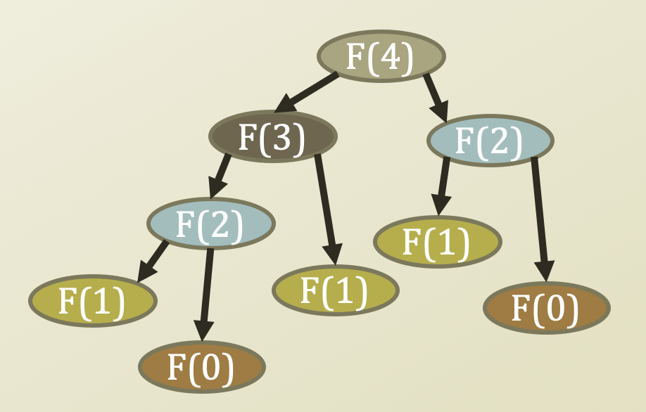
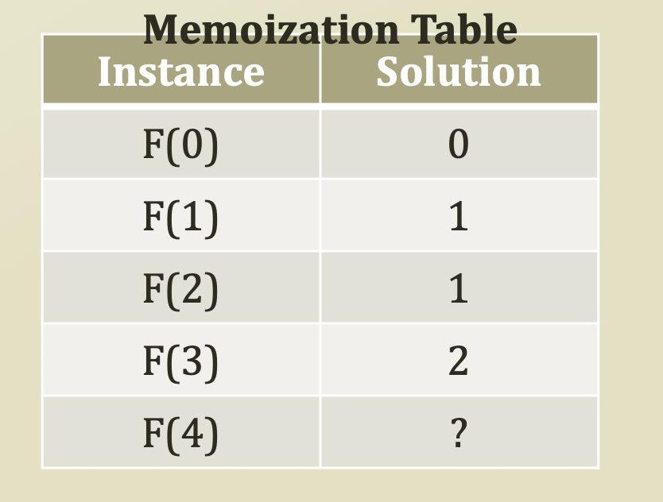
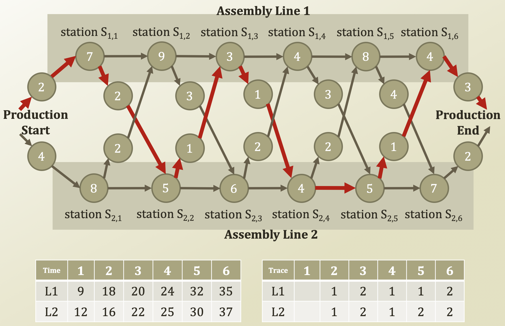
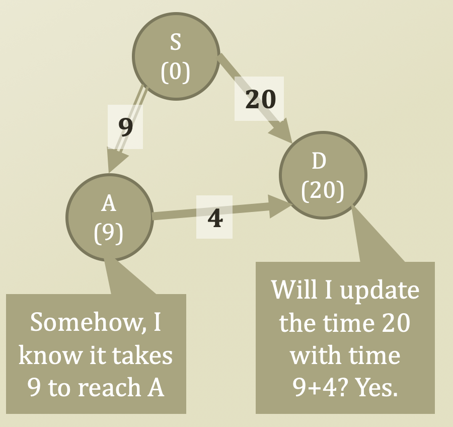
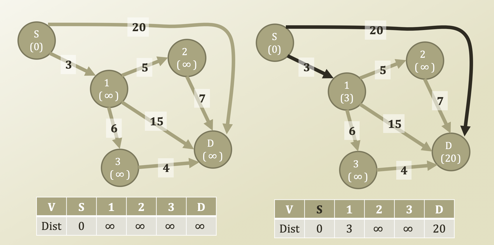
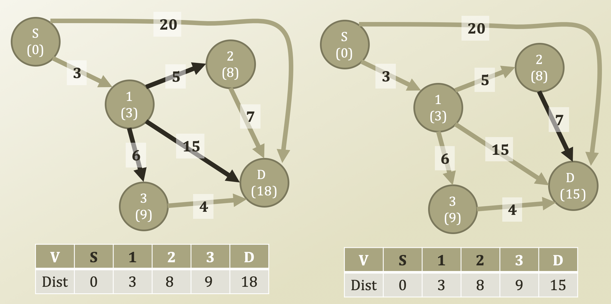
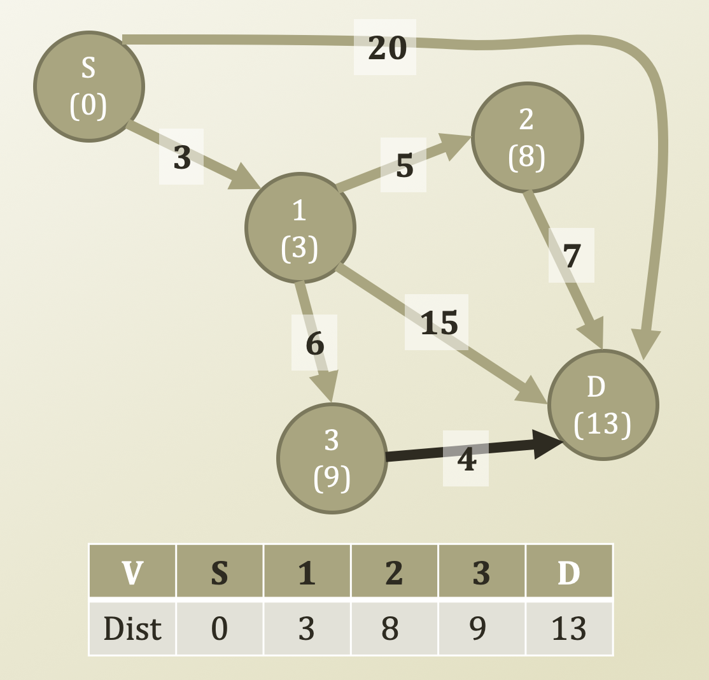

# 5. Shortest Path Problem - Dijkstra's Algorithm \(2\)

## Detour: Dynamic Programming 

* If we use recursion, there is a lot of overlap
  * For example, 2 F\(0\), 3 F\(1\), 2 F\(2\).
  * How can we solve this problem?
* Dynamic Programming:
  * A general algorithm design technique for solving problems defined by or formulated as **recurrences with overlapping sub-instances**
  * In this context, Programming = Planning
* Main storyline
  * Setting up a recurrence
    * Relating a solution of a larger instance to solutions of some small instances
    * Solve small instances, once
    * Record solutions in a table
    * Extract a solution of a larger instance from the table

## Detour: Tracing Assembly Line Scheduling in DP

## Dijkstra's Algorithm

* **Computer science is no more about computers than astronomy is about telescopes**
* V = the set of vertices
* W = the set of weights on edges
* s = the source vertex
* Dijkstra's Algorithm\(V, W, s\)
  * dist = { }                 \# Memoization Table
  * For itr in V
    * dist\[v\] = 'infinity′
  * dist\[s\] = 0
  * While size\(V\) != 0
    * u = getVertexWithMinDistance\(V, dist\) \# source at first
    * V.remove\(u\)
    * For neighbor in getNeighbors\(u\)
      * If dist\[neighbor\] &gt; dist\[u\] + w\(u, neighbor\) :
      * At first, 'infinity′ &gt; 0 + 20
        * dist\[neighbor\] = dist\[u\] + w\(u, neighbor\)
  * Return dist

## Progress of Dijkstra's Algorithm \(1\)

* Since vertex 1 has smallest distance, which is 3, stretch vertex 1 first

## Progress of Dijkstra's Algorithm \(2\)

* Now, we completed until vertex 1. Then, vertex 2, which distance is 8, has smallest value, stretch vertex 2

## Progress of Dijkstra's Algorithm \(3\)

* Now, since vertex 3 has smallest distance, which is 9, stretch vertex 3, then we will get a new distance to D, which has distanced 13
* Time Complexity
  * Simple Implementation
    * O\(\|E\| + \|V\|²\) = O\(\|V\|²\)
      * \|E\|: update distance
      * \|V\|²: procedure of finding minimum distance
      * Since \|V\|² is bigger than \|E\|, O\(\|E\| + \|V\|²\) = O\(\|V\|²\)
        * Because, \|V\|² means stretch every possible distance from a vertex
  * Can be reduced to further
    * Binary heap in searching the next node to expand
    * In average case, O\( \(\|E\| + \|V\|\)log\|V\| \)
      * We will not prove this
  * \|E\|
    * The number can vary
    * It can be close to
      * 1 = dense graph
      * 0 = sparse graph
    * If it is a dense graph,
      * \|E\| is almost equal to \|V\| \* \|V\|
      * Then?
      * O\(\|V\|²log\|V\|\)
      * More than a quadratic time complexity
      * Pretty expensive!
  * Therefore, in dense graph, Dijkstra's algorithm is not good approach I think

