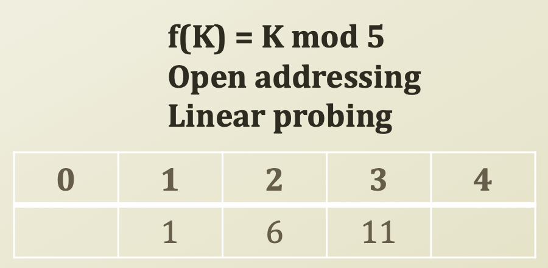
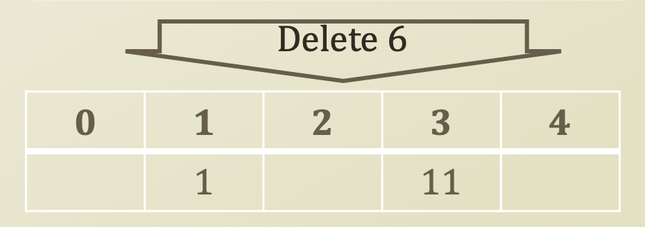
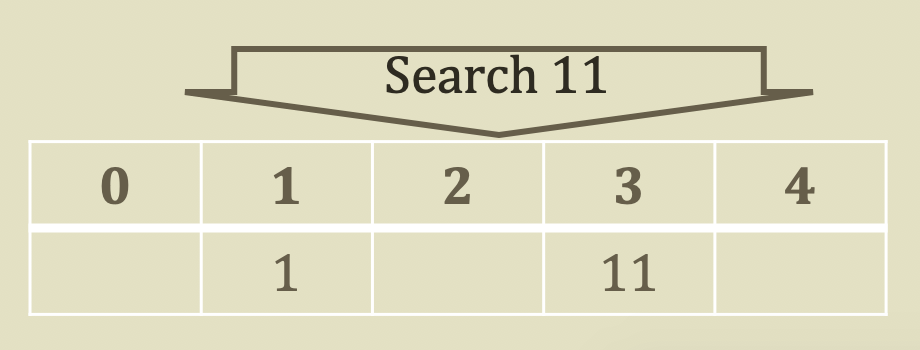

# 6. Deletion in Hash Table

## Deletion in Open Addressing Hash Table

* Deletion
  * Closed addressing
    * Simple
    * Go to the bucket, and follow the linked list, and delete it
  * Open addressing
    * Complicated
    * Intuitively...
      * Visit the index from the hash function 
      * If it is there, delete it
      * If not, keep following the probing method, find and delete it
      *  
      * Since this is open addressing and linear probing \(go to the next position if the position is fulfilled, 
      * f\(1\) = 1 mod 5 = 1. So, put 1 in position 1
      * f\(6\) = 6 mod 5 = 1. Since position 1 is fulfilled, go to the next position, which is 2
      * f\(11\) = 11 mod 5 = 1. Since position 1 is fulfilled, go to the next position, which is 2 and since position 2 is fulfilled, go to the next position, which is position 3
    * What is wrong with this idea?
      *  
        * Delete 6 is not a problem
      *  
        * After deleting 6, when you find 11, since position 2 is empty, it's a problem. Linear probing cannot find 11 then.
    * Problem Scenario?
    * Insert 1, 6, 11 with the same index from hash functions, resolved by linear probing
    * Deleting 6
    * And, searching 11 ← problem!
* Then?
  * Lazy Deletion
    * 6 을 지우지 않고, 6 옆에 표를 달아둔다. \(Remove 라고\)
    * 6 을 search 할 때, 6 옆에 지워졌다는 표시가 있기 때문에 search 하지 않는다.
    * You just mark it and do not delete it
    * Keep adding entries and no deletion
      * Why?
        * Cheap storage cost 
    * Then, if load factor, which is N/D is big, make a big new hash table and move all elements except elements such that labeled 'remove' to the new hash table
    * But, always there is a limit

