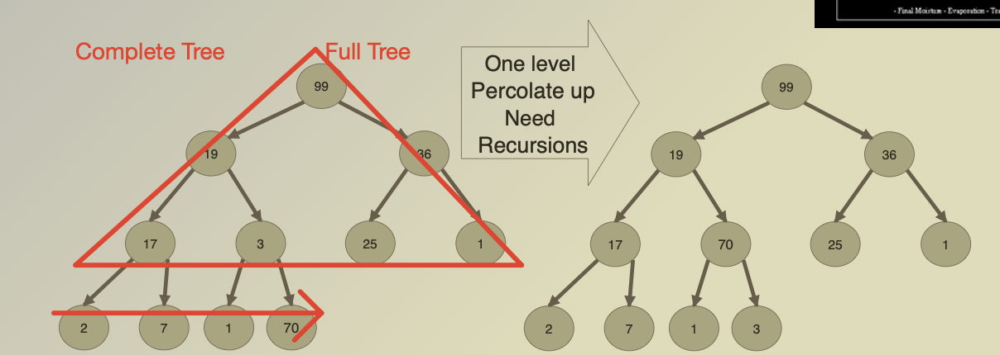
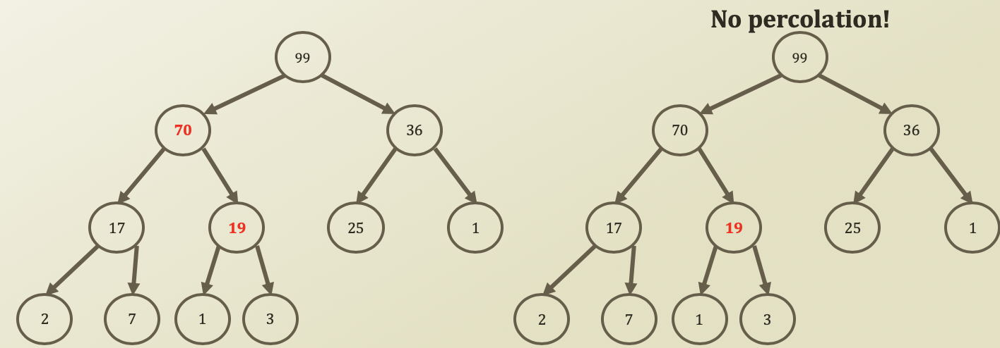

# 6. Insert Operation of Binary Heap

## Insert Operation of Binary Heap


* Insert of binary heap, a.k.a. Percolate-up \(삼투\)
  * Starting from a leaf
  * Approaching toward a root 
  * How to?
    * Insert a value at the next node to insert
    * Compare the value to the value of the inserted node's parent
    * If the value is bigger than the parent's
      * The heap property is broken
      * Exchange the two values
      * Repeat this comparison at the parent's node



```python
    def enqueueWithPriority(self, value, priority):
        self.arrPriority[self.size] = priority
        self.arrValue[self.size] = value
        self.size = self.size + 1
        self.percolateUp(self, size - 1)
    
    def percolateUp(self, idxPercolate):
        if idxPercolate == 0:
            return
        parent = int((idxPercolate - 1) / 2)
    
        if self.arrPriority[parent] < self.arrPriority[idxPercolate]:
            self.arrPriority[parent], self.arrPriority[idxPercolate] = self.arrPriority[idxPercolate], self.arrPriority[parent]
            self.arrValue[parent], self.arrValue[idxPercolate] = self.arrValue[idxPercolate], self.arrValue[parent]
            # Recursion of reduced size
            self.percolateUp(parent)
        
```





