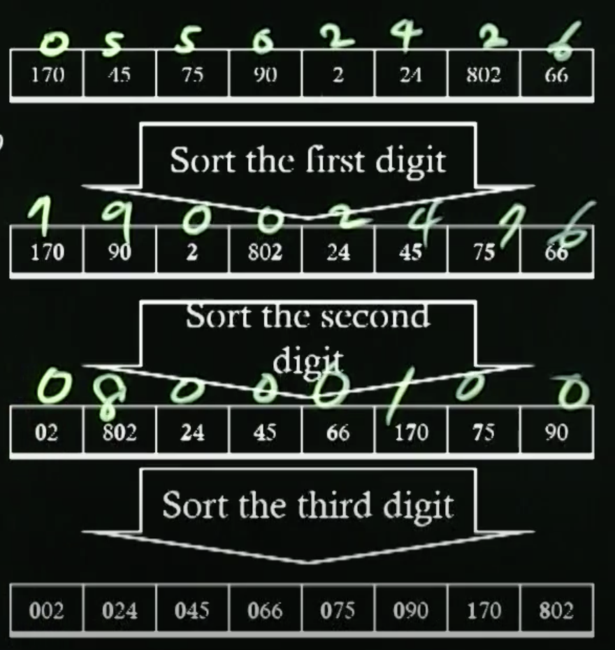
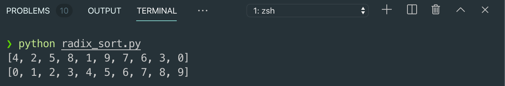
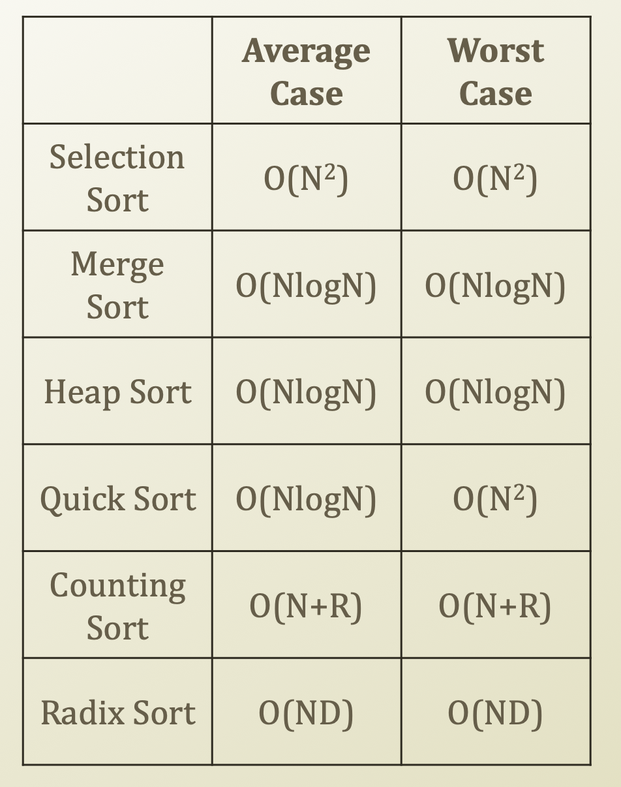

# 6. Radix Sort

## Radix Sort

* Assumption
  * The sequence contains integers
* Sort from the least important digit to the most important digit
  * Sort from 1000**2** to **1**0002
* Basic idea
  * For itr1 from 0 to D
    * Prepare a bucket list ranging from 0 to 9
    * For itr2 from 0 to N
      * digit = itr1th digit of seq\[itr2\]
      * Place a seq\[itr2\] in bucket\[digit\]
    * cnt = 0
    * For itr2 from 0 to 9
      * For itr3 from bucket\[itr2\]
        * seq\[cnt\] = bucket\[itr2\]\[itr3\]
        * cnt = cnt + 1
  * Therefore, 
  * O\(D\) \* \(O\(N\) + O\(N\)\) 
  * = O\(D\) \* O\(2N\) 
  * = O\(D\) \* O\(N\) 
  * = O\(ND\)
* Time Complexity
  * O\(ND\)
  * D = the digit number of the largest value
  * N = the size of the sequence
  * Since D's growth is very smaller than number's growth, we can think O\(ND\) = O\(N\) also.
    * For example, 30000 has the digit 4 and 300000 has the digit 5. When number changes from 30000 to 300000, number's growth is very big, but the digits are only changing from 4 to 5, just 1.
  * Is this a good approach?
    * Yes



## Implementation of Radix Sort

```python
import random
import math

# Random Number Generation
N = 10
lstNumbers = list(range(N))
random.shuffle(lstNumbers)

def performRadixSort(seq):
    # Finding the digit number
    max = -999999
    for itr in range(len(seq)):
        if seq[itr] > max:
            max = seq[itr]
    # 30000 -> 3*10^4 -> log(3*10^4) = log(3) + log(10^4)
    # -> 0.xxx + 4
    # int(0.xxx + 4) = 4
    # So, 30000 has 4 digits, which is from 0 to 4 
    D = int(math.log10(max)) 

    # Placing values into buckets
    for itr1 in range(0, D+1):
        buckets = []
        for itr2 in range(0, 10):
            buckets.append([])
        for itr2 in range(len(seq)):
            digit = int(seq[itr2] / math.pow(10, itr1)) % 10
            buckets[digit].append(seq[itr2])
        
        # Printing the partially sorted values
        cnt = 0
        for itr2 in range(0, 10):
            for itr3 in range(len(buckets[itr2])):
                seq[cnt] = buckets[itr2][itr3]
                cnt = cnt + 1
    return seq

print(lstNumbers)
print(performRadixSort(lstNumbers))
        
```



## Performance of Sorting Algorithm



* In the real world
  * Many people do not concern the time complexity of the sorting
  * Why?
    * Most of time, people rely on the database and "DESC" and "ASC"
    * Most of time, people do not give too much thought on this issue
      * Not a good idea
* You need to consider the cost of your system
  * Development
    * For example, development cost: 
    * Selection sort &lt; Radix sort
  * Maintenance
    * For example, maintenance cost:
    * Selection sort &gt; Radix sort

