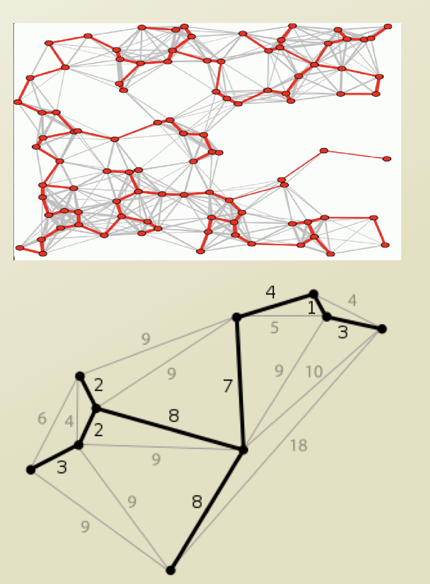
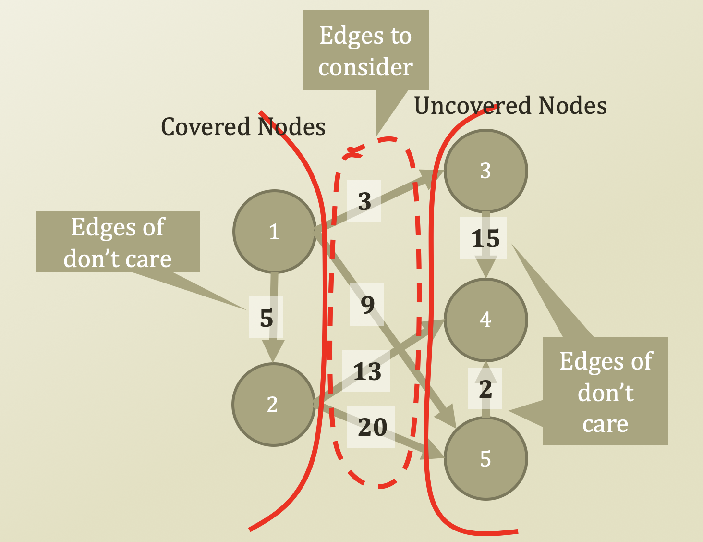
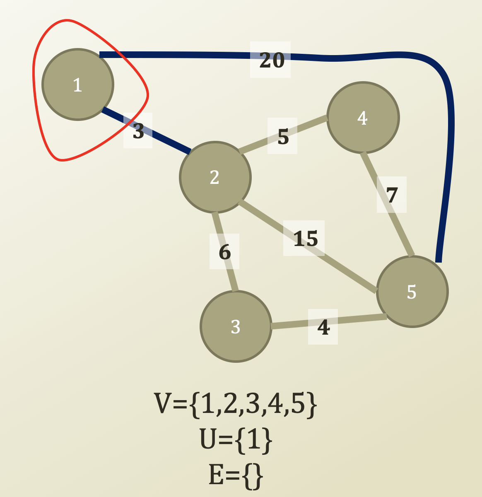
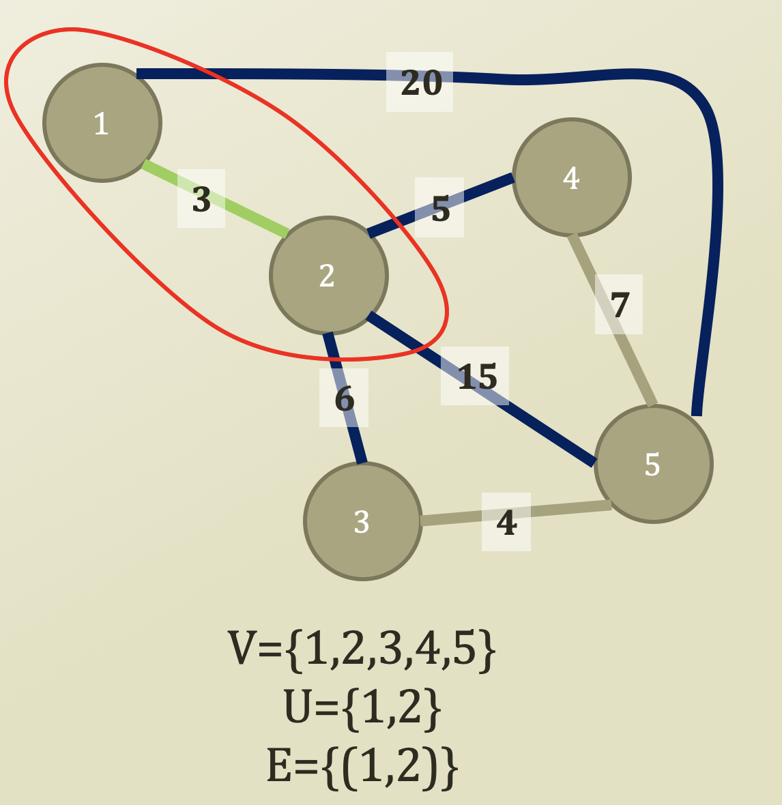
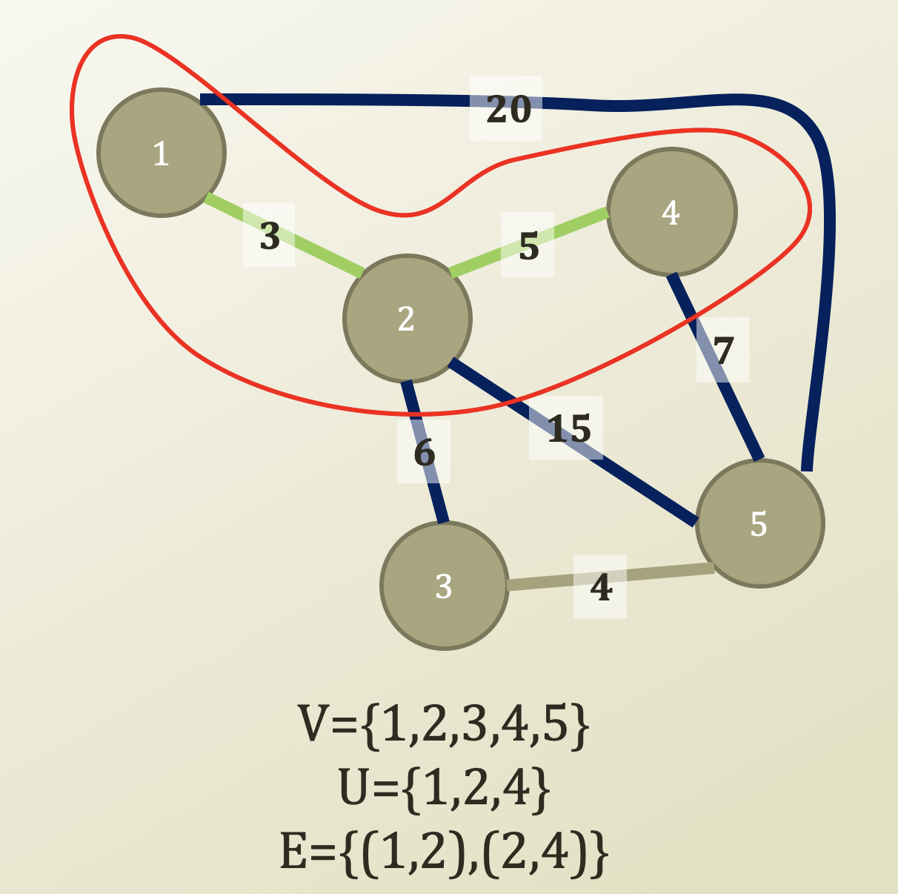
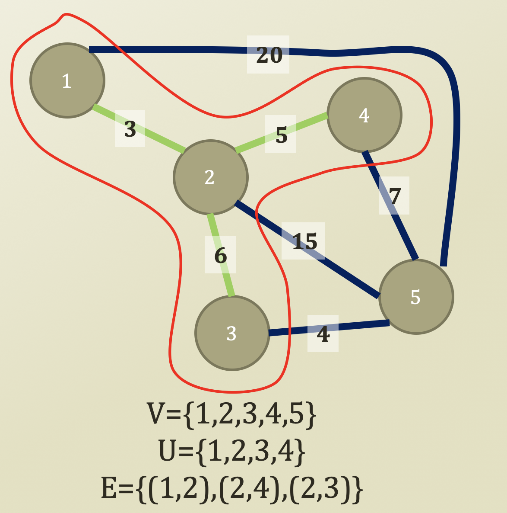
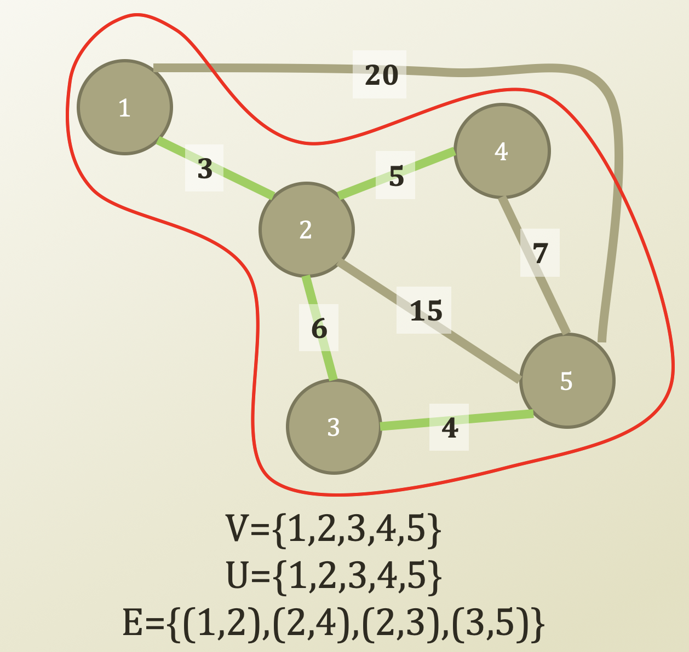

# 6. Minimum Spanning Tree Problem - Prim's Algorithm

## Minimum Spanning Tree Problem

* Shortest-path problem \(Path\)
  * Path planning from a selected source
  * Many times, algorithm for planning
* Minimum Spanning Tree \(Coverage\)
  * Network control problem
  * All vertex coverage with minimum cost
  * Algorithm from network design
    * Telephone network
    * Electricity grid network
    * TV cable network
    * Computer network
    * Road network
  * Evolving to the influence propagation tree
    * Social network influence
      * From one politician to all twitter accounts

## Prim's Algorithm

* V = the set of vertices
* U = the covered set of vertices
* W = the set of weights on edges
* E = the selected set of edges
* s = the source vertex
* Prim′s Algorithm\(V, W, s\)
  * U = {s}, E = { }
  * While U == V
    * edges = find edges of \(source, distance\) such that source ∈ U, distance ∈ V
    * e = getEdgeWithMinimumWeight\(edges\)
    * E = E ∪ {e}
    * U = U ∪ {e.distance}
  * Return E and U

## Progress of Prim's Algorithm \(1\)

* Covered Nodes: 1
* Uncovered Nodes: 2, 3, 4, 5
* Since there are two bridges from the covered nodes to the uncovered nodes, we select minimum \|bridges\|, which is 3

* Covered Nodes: 1, 2
* Uncovered Nodes: 3, 4, 5
* Then, there are four bridges from the covered nodes to the uncovered nodes. We will select minimum \|bridges\|, which is 5

## Progress of Prim's Algorithm \(2\)

* Covered Nodes: 1, 2, 4
* Uncovered Nodes: 3, 5
* Then, there are four bridges from the covered nodes to the uncovered nodes. We will select minimum \|bridges\|, which is 6

* Covered Nodes: 1, 2, 4, 3
* Uncovered Nodes: 5
* Then, there are four bridges from the covered nodes to the uncovered nodes. We will select minimum \|bridges\|, which is 4

## Progress of Prim's Algorithm \(3\)

* Since U == V, i.e., we covered all nodes, exit while loop
* Time Complexity
  * O\( \(\|E\| + \|V\|\)log\(\|V\|\)
    * We will not prove this
  * Same time complexity to the Dijkstra's algorithm

