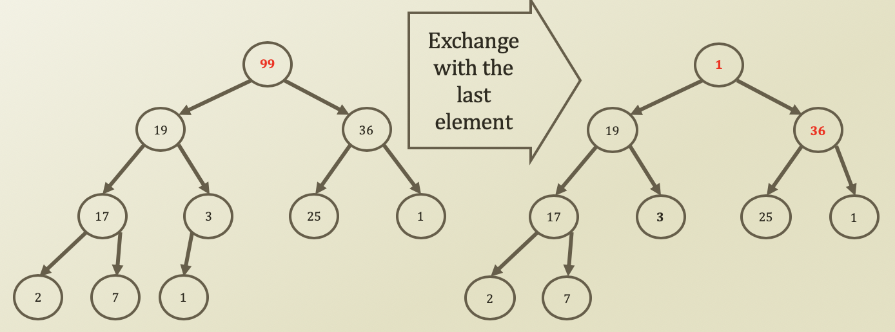

# 7. Delete Operation of Binary Heap

## Delete Operation of Binary Heap

* Delete of binary heap, a.k.a. Percolate-down or Cascade-down
  * Starting from a root
  * Approaching toward a leaf
  * How to?
    * Delete the root node value by replacing the node with the last node
    * Compare the value to the value of the inserted node's children
    * If the children's value is bigger than the parent's, \(pick a bigger child\)
      * The heap property is broken
      * Exchange the root value and the bigger value from children
      * Repeat this comparison at the exchange child's node




```python

def dequeueWithPriorityself):
    if self.size == 0:
        return ''
    # Set it up to the node
    retPrioirty = self.arrPriority[0]
    retValue = self.arrValue[0]

    # Last node's priority/value -> root's node
    self.arrPriority[0] = self.arrPriority[self.size - 1]
    self.arrValue[0] = self.arrValue[self.size - 1]
    self.size = self.size - 1
    self.percolateDown(0)
    return retValue

def percolateDown(self, idxPercolate):
    # If it approaches to the LHS of leaf node,
    if 2 * idxPercolate + 1 >= self.size:
        return
    else:
        leftChild = 2 * idxPercolate + 1
        leftPriority = self.arrPriority[leftChild]
    # If it approaches to the RHS of leaf node,
    # Since binary heap is complete tree, RHS could be
    # empty. So set it up as very small priority 
    # to choose LHS wiith comparison
    if 2 * idxPercolate + 2 >= self.size:
        rightPriority = -99999
    else:
        rightChild = 2 * idxPercolate + 2
        rightPriority = self.arrPriority[rightChild]
    
    if leftPriority > rightPriority:
        biggerChild = leftChild
    else:
        biggerChild = rightChild

    if self.arrPriority[idxPercolate] < self.arrPriority[biggerChild]:
        self.arrPriority[idxPercolate], self.arrPriority[biggerChild] = self.arrPriority[biggerChild], self.arrPriority[idxPercolate]
        self.arrValue[idxPercolate], self.arrValue[biggerChild] = self.arrValue[biggerChild], self.arrValue[idxPercolate]
        # Recursion to the smaller size
        self.percolateDown(biggerChild)
```

​

