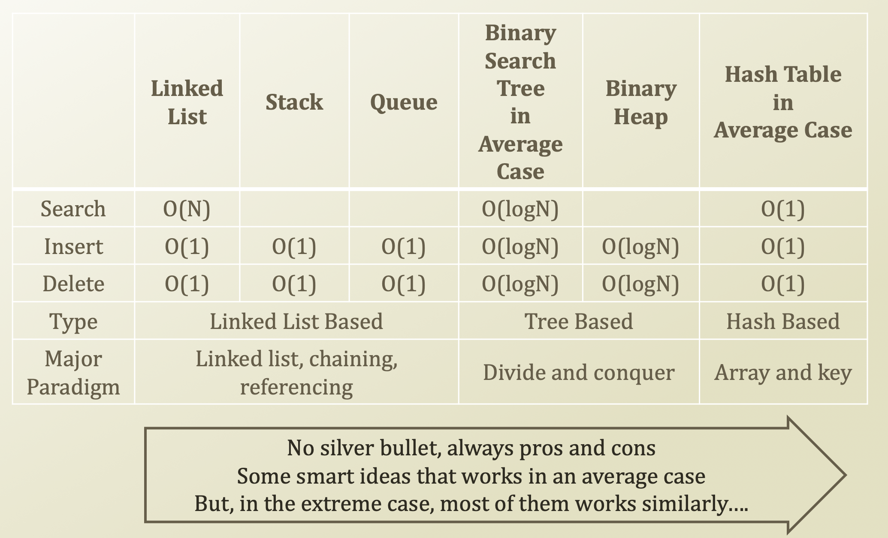

# 7. Managing the Size of Hash Table

## Managing The Hash Table Size

* There is always a limit
  * Even though the storage is cheap
  * You don't have an infinite storage
* If you don't delete entries
* Keep adding more entries
* Then, the table's load factor becomes higher
  * What this mean?
    * More probing to insert
* Hence, somtimes
  * You need to extend the storage space
  * And insert the entries to the new space with more buckets

## Performance on Hash Table

* Using appropriate data structures in specific cases is important.

