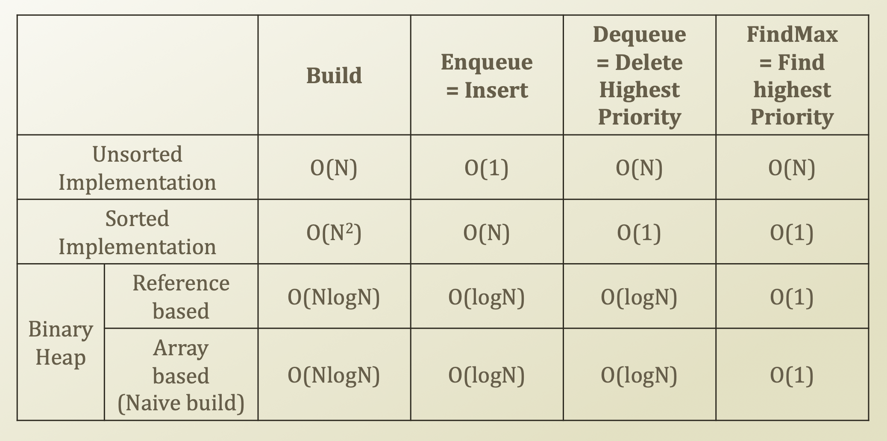

# 8. The Complexity of Priority Queue and Heap Sort

## Complexity of Priority Queue, again



## Heap Sort

* Priority Queue
  * Repeated, dequeue with the highest priority
  * = dequeue the maximum value
  * Well-utilizable for sorting
  * Particularly
    * Binary heap enables the dequeueing with O\(logN\)
    * For dequeueing all elements, it takes O\(NlogN\)
      * Same to the sorting all of the elements
* How to perform a sorting with a heap \(=heap sort\)
  * Given a list whose index ranges from 0 to N
  * Firstly, consider it as an insert to the heap from an array 
  * = O\(NlogN\)
    * It is the same problem of building a binary heap
  * Secondly, take out one element at a time = O\(NlogN\)
    * for i in range\(0, N\):
      * sorted\[i\] = Heap.getHighestPriority\( \)

```python
class BinaryHeap:
    arrPriority = {}
    arrValue = {}
    size = 0

    def __init__(self):
        self.arrPriority = {}
        self.arrValue = {}
        self.size = 0

    def enqueueWithPriority(self, value, priority):
        self.arrPriority[self.size] = priority
        self.arrValue[self.size] = value
        self.size = self.size + 1
        self.percolateUp(self.size - 1)
    
    def percolateUp(self, idxPercolate):
        if idxPercolate == 0:
            return
        parent = int((idxPercolate - 1) / 2)
        if self.arrPriority[parent] < self.arrPriority[idxPercolate]:
            self.arrPriority[parent], self.arrPriority[idxPercolate] = self.arrPriority[idxPercolate], self.arrPriority[parent]
            self.arrValue[parent], self.arrValue[idxPercolate] = self.arrValue[idxPercolate], self.arrValue[parent]
            self.percolateUp(parent)

    def dequeueWithPriority(self):
        if self.size == 0:
            return ''
        retPriority = self.arrPriority[0]
        retValue = self.arrValue[0]
        self.arrPriority[0] = self.arrPriority[self.size - 1]
        self.arrValue[0] = self.arrValue[self.size - 1]
        self.size = self.size - 1
        self.percolateDown(0)
        return retValue
    
    def percolateDown(self, idxPercolate):
        if 2 * idxPercolate + 1 >= self.size:
            return
        else:
            leftChild = 2 * idxPercolate + 1
            leftPriority = self.arrPriority[leftChild]
        
        if 2 * idxPercolate + 2 >= self.size:
            rightPriority = -99999
        else:
            rightChild = 2 * idxPercolate + 2
            rightPriority = self.arrPriority[rightChild]
        
        if leftPriority > rightPriority:
            biggerChild = leftChild
        else:
            biggerChild = leftChild
        
        if self.arrPriority[idxPercolate] < self.arrPriority[biggerChild]:
            self.arrPriority[idxPercolate], self.arrPriority[biggerChild] = self.arrPriority[biggerChild], self.arrPriority[idxPercolate]
            self.arrValue[idxPercolate], self.arrValue[biggerChild] = self.arrValue[biggerChild], self.arrValue[idxPercolate]
            self.percolateDown(biggerChild)

    def build(self, arrInputPriority, arrInputValue):
        for i in range(len(arrInputPriority)):
            self.arrPriority[i] = arrInputPriority[i]
            self.arrValue[i] = arrInputValue[i]
        self.size = len(arrInputPriority)
        for i in range(self.size-1, -1, -1):
            self.percolateDown(i)

pq = BinaryHeap()
pq.enqueueWithPriority('David', 1)
pq.enqueueWithPriority('President', 10)
pq.enqueueWithPriority('John', 2)
pq.enqueueWithPriority('Boss', 99)

print(pq.dequeueWithPriority())
print(pq.dequeueWithPriority())
print(pq.dequeueWithPriority())
print(pq.dequeueWithPriority())

print("------------------------------------------------")

pq2 = BinaryHeap()
pq2.build({0:1, 1:10, 2:3, 3:99}, {0:'David', 1:'President', 2:'John', 3:'Boss'})

print(pq2.dequeueWithPriority())
print(pq2.dequeueWithPriority())
print(pq2.dequeueWithPriority())
print(pq2.dequeueWithPriority())

```

