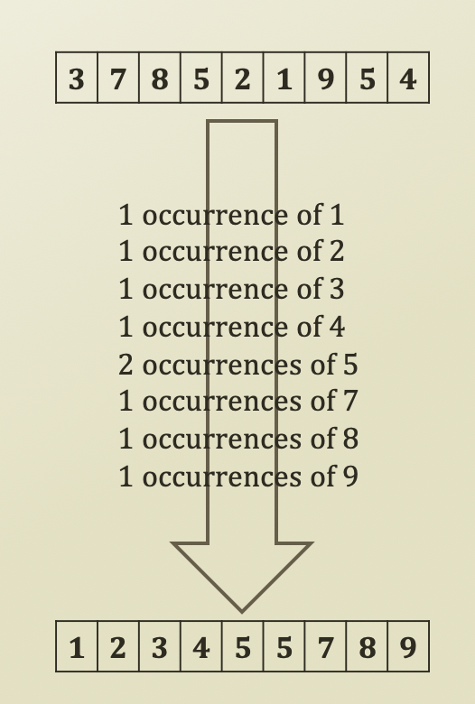
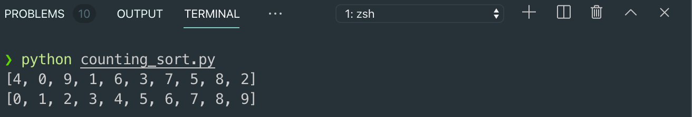

# O\(N\) Sorting

## O\(N\) Sorting

* Sorting Algorithm
  * Average case O\(N\) sorting
  * **Not comparison-based** approach
    * The best performance of the comparison based approach is O\(NlogN\)
    * Therefore, should not be based upon comparisons
  * Rather based upon counting and numeric properties
  * Variants
    * Counting Sort
    * Radix Sort
  * Pros and Cons?
    * Cons: assumptions and not comparison-based
    * Pros: best time complexity
      * Because O\(N\) is best time complexity

## Counting Sort

* Assumption
  * The sequence contains integers ranging from 0 to K
* **Count the occurrence** and produce a sequence based upon the counts
* Basic idea
  * For itr from 0 to N
    * Value = sequence\[itr\]
    * Count\[value\] = Count\[value\] + 1
  * For itr1 from 0 to K
    * For itr2 from 0 to Count\[itr1\]
      * Print itr1
  * Therefore, O\(N\) + O\(N\) = O\(2N\) → O\(N\)
* Time Complexity
  * O\(N + R\)
  * R = the range of the sequence values
    * R = ranging from 0 to K
    * In some case, if R is very big
  * N = the size of the sequence



```python
import random

# Random Number Generation
N = 10
lstNumbers = list(range(N))
random.shuffle(lstNumbers)

def performCountingSort(seq):
    # Preparing the counting space
    max = -9999
    min = 9999
    for itr in range(len(seq)):
        if seq[itr] > max:
            max = seq[itr]
        if seq[itr] < min:
            min = seq[itr]
    counting = list(range(max - min + 1))
    for itr in range(len(counting)):
        counting[itr] = 0

    # Perform Counting
    for itr in range(len(seq)):
        value = seq[itr]
        # In this case, you can start from anywhere. Shift
        counting[value - min] = counting[value - min] + 1
    
    # Print the counted numbers
    cnt = 0
    for itr1 in range(max - min + 1):
        for itr2 in range(counting[itr1]):
            seq[cnt] = itr1 + min
            cnt = cnt + 1
    return seq

print(lstNumbers)
print(performCountingSort(lstNumbers))
```



